# Requisitos Analizador Léxico.

# Propósito

   Para la primera etapa el objetivo es la implementación de un analizador léxico para minijava. Para hacer uso del mismo se requiere de un Módulo Principal cliente del Léxico que:

   

- Manejara la interfaz con el usuario  
- Mostrará los tokens reconocidos por el léxico.  
- Reportará errores léxicos detectados por el analizador.

# Tokens

Para facilitar la escritura se utilizará regex para referirse a expresión regular.

Notación usada en esta sección (expresiones regulares estilo POSIX/ERE): `[a-z]` clase de caracteres, `*` cero o más, `+` uno o más, `?` cero o uno, `{m,n}` entre `m` y `n` repeticiones, `|` alternativa, `[^...]` cualquier carácter salvo los listados, y todo lo que no sea un metacarácter de regex es literal. El nombre de cada token es el que efectivamente imprime el compilador (el `getNombre()` de `TokenType`), para que sea fácil cruzarlo contra la salida real.

**Aclaración importante:** las expresiones de acá describen el **lenguaje que arma un token válido**. La mayoría de los estados del autómata, al toparse con algo que *casi* matchea pero no del todo (una letra pegada a un número, un `&` sin su segundo `&`, un salto de línea dentro de un string), no simplemente fallan el match y prueban con otra regla: consumen lo que corresponda y reportan un error explícito (REQ-AL-19/22, ver "Autómata finito" y "Casos de prueba" para el detalle de cada uno). Eso se menciona en la nota de cada token donde aplica, pero no forma parte de la regex del token en sí.

## Palabras clave (REQ-AL-03)

Las 20 se arman todas de la misma forma: no son una rama aparte del autómata, se arman como `idMV` (letra minúscula + continuación) y recién al cerrar el lexema se controlan contra la tabla de palabras clave. Por maximal munch, si el lexema completo no coincide exactamente con la palabra reservada (ej. `if0`, `true1`, `class1`, `null1`), queda como `idMV` en vez de la keyword — por eso las notas de abajo solo aparecen donde hay algo puntual para decir.

`pr_class` — `class`

`pr_extends` — `extends`

`pr_interface` — `interface`

`pr_implements` — `implements`

`pr_static` — `static`

`pr_boolean` — `boolean`

`pr_char` — `char`

`pr_int` — `int`

`pr_void` — `void`

`pr_public` — `public`

`pr_if` — `if`
Notas: probado explícitamente: `if0` no matchea esta keyword, queda como `idMV(if0)` (ver Casos de prueba).

`pr_else` — `else`

`pr_while` — `while`

`pr_return` — `return`

`pr_var` — `var`

`pr_this` — `this`

`pr_new` — `new`

`pr_null` — `null`
Notas: probado explícitamente: `null1` no matchea esta keyword, queda como `idMV(null1)` (ver Casos de prueba).

`pr_true` — `true`
Notas: probado explícitamente: `true1` no matchea esta keyword, queda como `idMV(true1)` (ver Casos de prueba).

`pr_false` — `false`

Además, las palabras clave de Java que **no** están en esta lista (`private`, `for`, `switch`, `do`, `try`, `catch`, `package`, `import`, etc.) no tienen ningún tratamiento especial: al no figurar en la tabla, se reconocen como identificadores comunes (`idMV` o `idClase`, según la letra inicial), sin error (REQ-AL-03).

## Identificadores

`idClase` — `[A-Z][A-Za-z0-9_]+`
Notas: mayúscula **seguida de uno o más** caracteres más — por eso una sola mayúscula nunca puede ser `idClase` (ver `idGen`, abajo).

`idGen` — `[A-Z]`
Notas: una mayúscula **sola**, sin nada más después. Se solapa como *prefijo* con `idClase` (ambas regex arrancan con `[A-Z]`); se resuelve por maximal munch: si viene algo más que continúa el identificador, gana `idClase`. Consecuencia: en miniJava no se puede nombrar una clase o interfaz con una sola letra — esa `A` siempre es `idGen`, incluso después de `class` (ver Casos de prueba).

`idMV` — `[a-z][A-Za-z0-9_]*`
Notas: minúscula seguida de cero o más caracteres. Cualquier palabra clave es, por forma, un caso particular de esta regex — se descarta por la tabla de palabras clave (ver arriba), no por la regex.

## Literales numéricos (REQ-AL-09/21)

`intLiteral` — `[0-9]{1,9}`
Notas: el `{1,9}` es la forma de expresar "al menos un dígito, como máximo nueve" con un solo cuantificador. Si aparece un 10º dígito (o más) sin punto ni exponente de por medio, el autómata no corta en el noveno: sigue leyendo el lexema completo y lo reporta como error de desborde, en vez de dejar el resto suelto.

`floatLiteral` — `[0-9]+(\.[0-9]*([eE][+-]?[0-9]+)?|[eE][+-]?[0-9]+)[fFdD]?`
Notas: dos formas válidas — con punto (`3.14`, `3.`, `3.14e10`) o sin punto pero con exponente (`3e10`); un entero suelto sin punto ni `e`/`E` es `intLiteral`, no float. La parte decimal después del punto puede tener **cero** dígitos (`3.` es válido, como en Java). El exponente, si aparece, exige **al menos un dígito** (`3e` o `3e+` solos son error). El sufijo `f`/`F`/`d`/`D` final es opcional. **A diferencia de `intLiteral`, acá no hay límite de 9 dígitos** — ni en la parte entera ni en la decimal — porque REQ-AL-21 no lo impone (confirmado: `1234567890.5` y `1234567890e2` son válidos).

## Literales de carácter y string

`charLiteral` — `' ( [a...z] | [A...Z] | [0...9] | espacio | símbolo | \u[0...9a...f]{4} | \caracter ) '`
Notas: son alternativas (una sola de todas estas, no las tres primeras seguidas) entre la comilla de apertura y la de cierre:
- `[a...z]`, `[A...Z]`, `[0...9]`: una letra minúscula, una mayúscula, o un dígito — **corregido de `[1...9]` a `[0...9]`, porque `'0'` también es válido** (lo probé contra el jar).
- `espacio` y `símbolo`: el carácter espacio, o cualquier otro símbolo de puntuación (`%`, `:`, `@`, etc.) — sin estos dos, la lista de arriba se queda corta: `' '` y `'%'` también están confirmados como válidos contra el jar, y ninguno es letra ni dígito.
- `\u[0...9a...f]{4}`: escape Unicode (REQ-AL-20) — `\` + `u` **minúscula** + exactamente 4 dígitos hexadecimales. Ej: `'A'`.
- `\caracter`: `\` seguido de **cualquier otro carácter** (incluida la comilla, otra `\`, un espacio, o `U` mayúscula) — **salvo `u` minúscula** (esa ya la cubre la alternativa de arriba: en cuanto el autómata ve `\u`, siempre exige los 4 hex después, no hay forma de escapar una `u` minúscula "a secas") **y salvo un salto de línea real** (nunca es válido, ver "Correcciones aplicadas" en Casos de prueba). Ej: `'\z'`, `'\''`, `'\\'`, `'\ '`, `'\U'` son todos válidos por acá.

Ninguna alternativa matchea si el contenido queda vacío (`''`), si sobra más de un carácter antes de la comilla de cierre (`'ab'`), o si un escape Unicode no trae los 4 hex — son errores (ver Casos de prueba para el detalle de las cascadas que puede disparar cada uno).

`litString` — `" ( [a...z] | [A...Z] | [0...9] | espacio | símbolo | \u[0...9a...f]{4} | \caracter )* "`
Notas: mismas alternativas que `charLiteral`, con dos diferencias: el delimitador es `"` en vez de `'` (así que acá `símbolo` sí incluye a `'`, y en cambio excluye a `"`; por eso `\"` cae en `\caracter` y no cierra el string, REQ-AL-11), y se repiten **cero o más veces** (`*`) en vez de exactamente una — por eso `""` (string vacío) es válido, a diferencia de `''`. Un `\` justo antes de un salto de línea real tampoco es `\caracter` válido acá — corta el string igual que si no hubiera backslash (ver "Correcciones aplicadas" en Casos de prueba).

## Símbolos de puntuación (REQ-AL-14)

Los 10 son caracteres literales sueltos, sin ambigüedad entre sí ni con ningún otro token.

`parA` — `(`

`parC` — `)`

`llaveA` — `{`

`llaveC` — `}`

`corcheteA` — `[`

`corcheteC` — `]`

`puntoYComa` — `;`

`coma` — `,`

`punto` — `.`
Notas: nunca es el inicio de un float, porque REQ-AL-21 exige que el float empiece con dígito. Por eso `.5` son dos tokens (`punto` + `intLiteral`), no uno.

`dosPuntos` — `:`

## Operadores de un solo carácter (REQ-AL-15)

`op>` — `>`
Notas: válido solo, sin necesitar un segundo carácter. Si lo sigue `=`, gana `op>=` (maximal munch, ver abajo).

`op<` — `<`
Notas: válido solo. Si lo sigue `=`, gana `op<=`.

`op!` — `!`
Notas: válido solo. Si lo sigue `=`, gana `op!=`.

`op=` — `=`
Notas: válido solo. Si lo sigue `=`, gana `op==`.

`op%` — `%`
Notas: válido solo; no tiene ninguna forma compuesta.

`op+` — `+`
Notas: válido solo. Si lo sigue `+`, gana `op++`.

`op-` — `-`
Notas: válido solo. Si lo sigue `-`, gana `op--`.

`op*` — `*`
Notas: válido solo; no tiene ninguna forma compuesta.

`op/` — `/`
Notas: válido solo, pero si lo sigue otro `/` arranca un comentario de línea (REQ-AL-18) y si lo sigue `*` arranca un comentario de bloque — en ninguno de los dos casos se arma este token, el comentario se descarta entero.

## Operadores de dos caracteres (REQ-AL-15)

`op==` — `==`
Notas: maximal munch sobre `op=`: si el segundo `=` no acompaña, queda en `op=`.

`op>=` — `>=`
Notas: maximal munch sobre `op>`: si no viene el `=`, queda en `op>`.

`op<=` — `<=`
Notas: maximal munch sobre `op<`: si no viene el `=`, queda en `op<`.

`op!=` — `!=`
Notas: maximal munch sobre `op!`: si no viene el `=`, queda en `op!`.

`op++` — `++`
Notas: maximal munch sobre `op+`: si no viene el segundo `+`, queda en `op+`. Por eso `+++5` se lexea como `op++` + `op+` + `intLiteral(5)` — tres tokens léxicamente válidos, aunque no formen una expresión válida (eso es alcance de la etapa sintáctica, ver Casos de prueba).

`op--` — `--`
Notas: mismo criterio que `op++`, con `-`. `----5` se lexea como `op--` + `op--` + `intLiteral(5)`.

## Operadores `&&` / `||` (REQ-AL-15)

`op&&` — `&&`
Notas: **a diferencia de los demás operadores de dos caracteres, acá no hay una versión de un solo carácter válida.** Un `&` suelto no es ningún token de miniJava — si no lo sigue un segundo `&`, es error léxico en vez de quedar como un token de un carácter.

`op||` — `||`
Notas: mismo criterio que `op&&`, con `|`. Un `|` suelto también es error léxico.

## Fin de archivo (REQ-AL-16)

`EOF` — *(no hay entrada, es la condición de "no queda más para leer")*
Notas: se emite una única vez, al final, con lexema fijo `$` — una convención de impresión, no un carácter que exista en el archivo. Un `$` real en el código fuente es un carácter no reconocido y da error (REQ-AL-19), sin ninguna relación con este token (ver Casos de prueba).

# Requisitos

## Módulo Principal

| REQ-MP-01 | El módulo principal debe ofrecer una interfaz al usuario el cual permita el uso del mismo. CLI |
| :---- | :---- |
| REQ-MP-02 | Toda salida debe realizarse por System.out |
| REQ-MP-03 | Debe recibir como parámetro el archivo fuente MiniJava. Debe aceptarse cualquier tipo de extensión. |
| REQ-MP-04 | El Módulo principal deberá mostrar los tokens que recibe el léxico de a uno por línea y usando la estructura **(Nombre token, lexema, Nro Linea)** |
| REQ-MP-05 | En caso de no detectarse errores debe haber una salida \[SinErrores\] |
| REQ-MP-06 | El módulo principal debe reportar los errores léxicos detectados por el analizador léxico. |
| REQ-MP-07 | El programa debe poder compilarse como por ejemplo  java \-jar Compilador.jar programa1.java |
| REQ-MP-08 | El módulo principal cuando reporta un error además del número de línea y la razón del error, muestra la línea en cuestión y apunta al lugar donde se produjo. Por ejemplo para el siguiente programa “hola” v1 \+ \# chau if class} Error Léxico en línea 2: \# no es un símbolo válido Detalle: v1 \+ \# chau ^ \[Error:\# |

## Manejador de archivos

Implementado por la catedra. Estas es la información a tener en cuenta

La interfaz del manejador de archivos provisto por la cátedra tiene la siguientes interfaz

public interface SourceManager {  
void open(String filePath) throws FIleNotFoundException  
void close() throws IOException  
void getNextChar() throws IOEXCEPTION.  
int getLineNumber();  
public static final char END\_OF\_FILE \= ( char ) 26;  
}

La clase que implementa la interfaz

public class SourceManagerImpl implements SourceManager{  
private BufferedReader reader;  
private String currentLIne;  
private int lineNumber;  
private int lineIndexNumber;  
private boolean mustReadNextLine;

public SourceManagerImpl() {  

	currentLine \\= “ “;  

	lineNumber \\= 0;

Se debe implementar otro manejador de archivos que administre de forma más eficiente la fuente. En particular, en vez de leer de a líneas de la fuente debe leer de a caracteres. Para esto debe valerse solo de las librerías de manejo IO de Java. El nuevo manejador debe conformarse con la interface SourceManager\*.

Puede que por algún otro logro sea necesario expandir la interfaz provista por la cátedra.

## Analizador Léxico

| REQ-AL-01 | El analizador léxico debe seguir la técnica vista en clase de método x estado. Es decir, para la representación de los AF vamos a hacer un método por estado. |
| :---- | :---- |
| REQ-AL-02 | El analizador léxico debe ser capaz de reconocer los lexemas de MiniJava que son palabras claves, nombres de tipo, literales, simbolos de puntuación, operadores e identificadores. |
| REQ-AL-03 | EL analizador léxico debe reconocer como palabras claves a las siguientes: class, extends, interface, implements, static, boolean, char, int, void, public, if, else, while, return, var, this, new, null, true, false. Palabras clave presentes en Java pero no en miniJava (por ejemplo private, for, switch, do, try, catch, package, import, etc.) **no se consideran prohibidas ni reciben tratamiento especial:** al no figurar en la tabla de palabras clave de miniJava, se reconocen como identificadores comunes (idMetVar o idClase, según corresponda por su letra inicial), sin generar error léxico. El analizador debe reconocer 3 tipos de identificadores. El analizador léxico debe contar con una tabla con todos los lexemas de las palabras claves y cuando se arme un token identificador controlar si es o no una palabra clave de la tabla y devolver le token que corresponda. |
| REQ-AL-04 | El analizador debe reconocer al identificador de clase o interfaz que es una letra mayúscula seguida de uno o más caracteres que puede ser **letras, mayúsculas, minúsculas, dígitos o underscores.** Estos son denotados como **idClase.** |
| REQ-AL-05 | El analizador debe reconocer identificador de parámetro que es una única letra mayúscula. Estos son denotados como **idGen.** |
| REQ-AL-06 | Un identificador de método o variable es una letra minúscula seguida de 0 o mas caracteres que pueden ser letras mayúsculas, minúsculas, dígitos o underscores.  Estos son denotados como **IdMetVar.** |
| REQ-AL-07 | Ningún identificador puede ser palabra reservada. |
| REQ-AL-08 | El analizador léxico debe reconocer 5 tipos de literales |
| REQ-AL-09 | El analizador léxico debe reconocer literales enteros. No puede contener más de 9 dígitos y su valor corresponde a su interpretación estándar en base 10\.  Este se denota como **intLiteral**. Un cero a la izquierda **no** es un caso especial: al ser "base 10 siempre" y no existir en miniJava el prefijo octal de Java, un literal como `0231` se reconoce igual que cualquier otro entero (nueve dígitos como máximo) y se interpreta en base 10 (`0231` vale 231, no 153 como en Java). |
| REQ-AL-10 | El analizador léxico debe reconocer los literales de carácter. de la forma ´x' que puede ser cualquier carácter excepto la barra invertida o la comilla simple. ´\\x'donde x es cualquier carácter  Este se denota como **charLiteral.** |
| REQ-AL-11 | El analizador léxico debe reconocer los literales String, se representa mediante una comilla doble (“) seguida de una secuencia de caracteres y finaliza con otra comilla doble (“). Al que en Java la secuencia de caracteres no puede ser interrumpida por un salto de línea. También como en Java, es posible que en la secuencia de caracteres aparezca una comilla doble siempre y cuando se la antecede por el carácter\\ Por eso la la comilla doble que marca el final de un string correcto nunca estará antecedida por ese carácter. **El valor del carácter corresponde a la cadena de caracteres entre comillas.** Se denota como stringLiteral. |
| REQ-AL-12 | Los literales booleanos se representan mediante las palabras reservadas **true** y **false**. |
| REQ-AL-13 | El literal nulo se representa mediante la palabra reservada **null**. |
| REQ-AL-14 | El analizador debe ser capaz de reconocer los siguientes simbolos de puntuación utilizados para estructurar los programas. ( ) { } \[ \] ; , . : |
| REQ-AL-15 | El analizador debe reconocer los siguientes operadores:  \> \< \! \= \==  \>=  \<=  \!=  \&\& \|\| % \+ \- \* /  \++  \- \- |
| REQ-AL-16 | El analizador debe reconocer al end of file como un token mas, y su lexema es $ |
| REQ-AL-17 | Los espacios en blanco son parte del lenguaje. Un salto en linea puede ser representado mediante cualquiera de las siguientes convenciones LF: equivale al cáracter del salto línea \\n  CR: Equivale al cáracter de retorno de carro \\r CRLF: equivale a la secuencia formada por un retorno de carro seguido de una salto de linea \\r \\n Cada una de estas representaciones debe considerarse como un único salto de línea. En particular, la secuencia \\r \\n no debe contabilizarse como dos saltos de linea. El analizador léxico debe ser capaz de reconocer correctamente cualquiera de estas convenciones y reportar números de linea equivalentes para archivos de fuente que difieran únicamente en la forma de representar sus saltos de línea. |
| REQ-AL-18 | Los comentarios son ignorados por el analizador léxico, **no** son tokens. Hay dos tipos de comentarios /\* comentario \*/ Comentario multilínea // comentario Comentario simple |
| REQ-AL-19 | Cualquier otra entrada que no conforme con las reglas presentadas debe generar error. |
| REQ-AL-20 | El analizador léxico es capaz de procesar correctamente caracteres únicos dentro de los literales de string y de carácter. Esto también requiere interpretar correctamente las secuencias escapadas Unicode (por ejemplo, \\u0041 que representa al carácter 'A'. |
| REQ-AL-21 | El analizador léxico es capaz de procesar correctamente letras Floats. Estos deben tener la misma estructura que los floats de Java con la salvedad de que siempre deben comenzar con un dígito. Esto incluye el sufijo de tipo `f`/`F`/`d`/`D` (FloatTypeSuffix) que Java admite al final de un float, que se reconoce y descarta como parte del lexema aunque miniJava no tenga `float`/`double` como tipos declarables. |
| REQ-AL-22 | El analizador no finaliza la ejecución ante el primer error léxico ( se recupera y es capaz de reportar todos los errores léxicos que tenga el programa fuente en una corrida. |

## AnalizadorHandler

| REQ-AH-01 | AnalizadorHandler va a ser un módulo puente para el manejador de archivos y el analizador léxico. De esta forma el analizador léxico se focaliza en el análisis léxico y AnalizadorHandler controla el paso de tokens. |
| :---- | :---- |

# Caso de uso

Ejemplo de uso del programa  
Fuente MIniJava

“hola”  
v1 \+ chau  
if class }

Debería mostrar

(litString,”hola”,1)  
(idMV,v1,2)  
(op+,+,2)  
(idMV,chau,2)  
(pr\_if,if,3)  
(pr\_class,class,3)  
(llaveC, },3)  
(EOF,$,3)

\[SinErrores\]

# Especificaciones de implementación

## Arquitectura del programa

El programa es pequeño pero tratando de respetar buenas practicas del software armar una arquitectura limpia basada en el patrón MVC. Pero hay que analizar si el mantener un código mas limpio interfiere en la eficiencia del sistema.

![][image1]

Estrictamente esto no es MVC clásico (no hay eventos de usuario ni una vista que observe cambios del modelo), es más bien un **pipeline en capas**: Vista → Controlador → Modelo, ejecutado una sola vez de punta a punta. El nombre MVC se mantiene por prolijidad con las buenas prácticas pedidas, pero conviene tenerlo presente a la hora de justificar el diseño.

### ¿Las capas afectan la eficiencia?

No, siempre que se respete una única regla: separar lo que se ejecuta **una vez por carácter** de lo que se ejecuta **una vez por archivo o por token**.

- Una llamada a método extra en Java cuesta nanosegundos y el JIT normalmente la inlinea. La cantidad de capas en sí misma no es un problema de performance.  
- El camino caliente del sistema es el loop caracter-a-caracter (`getNextChar` + transiciones de estado + acumulación del lexema), que corre una vez por cada carácter del archivo fuente. Todo lo demás (arranque, impresión, reporte de errores) corre una vez por archivo o una vez por token y su costo es irrelevante.  
- Por eso `AnalizadorLexico` debe leer directamente de `SourceManager` (tal como ya lo muestra el diagrama con la flecha directa entre ambos), y **no** a través de `LexicoHandler`. El Handler solo debe intervenir a nivel grueso: instanciar y conectar (`SourceManagerImpl` ↔ `AnalizadorLexico`) al arrancar, y recibir tokens/errores ya producidos para pasarlos al Módulo Principal. Si el Handler quedara en el medio de cada `getNextChar()` no rompería nada funcionalmente, pero sería indirección redundante sin motivo.

### Dónde sí está el costo real (y cómo cuidarlo)

1. **Buffering del nuevo `SourceManager` char-a-char.** "Leer de a caracteres" no debe traducirse en un `read()` de sistema por carácter: envolver el `FileReader`/`InputStreamReader` en un `BufferedReader` (o usar un buffer propio `char[]`) para que las lecturas físicas sean en bloques y `getNextChar()` sólo consuma del buffer en memoria.  
2. **Normalización de fin de línea (LF/CR/CRLF).** Resolverlo con un lookahead de un solo carácter dentro del propio `SourceManager` (si el carácter es `\r`, mirar el siguiente y consumirlo también si es `\n`), sin releer el archivo ni usar expresiones regulares.  
3. **Construcción de lexemas con `StringBuilder`**, evitando concatenación de `String` (`+=`) en el loop, que es O(n²).  
4. **Lookahead de un carácter para operadores compuestos** (`<` vs `<=`, `&&`, `//` vs `/*`, `++`, etc.). En vez de expandir la interfaz `SourceManager` con `unread`/`peek`, mantener un único carácter de lookahead como variable interna de `AnalizadorLexico`: más simple, O(1) en memoria, y no compromete la interfaz provista por la cátedra.  
5. **Tabla de palabras clave** como `Map<String, TokenType>` (o `enum TokenType`) para lookup O(1), en vez de una cadena de `if/else`.  
6. **No acumular todos los tokens en una lista antes de imprimir.** El módulo principal debe mostrarlos de a uno (REQ-MP-04), así que `AnalizadorLexico`/`AnalizadorHandler` conviene diseñarlos como productores incrementales (pull `siguienteToken()` o push por callback) en vez de tokenizar todo el archivo y recién después iterar. Memoria O(1) en vez de O(cantidad de tokens).  
7. **Método por estado (REQ-AL-01) sin recursión profunda.** Es una técnica pedagógica obligatoria, no se optimiza fuera de ella, pero cada método de estado debe devolver el control a un loop/dispatcher central en vez de encadenarse recursivamente entre sí, para que el uso de stack sea O(1) independientemente del largo del lexema (por ejemplo, un string literal muy largo no debería generar una pila de llamadas proporcional a su longitud).  
8. **Errores no fatales (REQ-AL-22).** Acumularlos en una lista propia está bien: está acotada por la cantidad de errores, no por el tamaño del archivo, así que no es un problema de performance.

### Aclaración sobre el diagrama: la flecha `Módulo Principal → Fuente MiniJava`

Esta flecha es **conceptual, no una referencia literal en código**. Se confirmó revisando la implementación final: `ModuloPrincipal.main` recibe el path como un `String` (`args[0]`) y se lo pasa tal cual a `AnalizadorHandler.analizar(rutaArchivo, listener)` — la Vista nunca instancia ni toca `SourceManager` (Model). Es recién dentro de `AnalizadorHandlerImpl` (Controller) donde se crea el `SourceManager` y se abre el archivo. La flecha en el diagrama solo representa que el usuario aporta ese path por línea de comandos (REQ-MP-03/07); la separación de capas Vista → Controlador → Modelo se respeta en el código real.

**Conclusión:** mantener la arquitectura en capas no interfiere con la eficiencia del sistema. El trabajo de optimización real está en el buffering de I/O del nuevo `SourceManager` y en evitar allocations/O(n²) en la construcción de lexemas, no en la cantidad de clases intermedias.

## Interfaces

### Interfaz SourceManager

Versión final, ya con la extensión anticipada en "Manejador de archivos" (`getLineaActual`, agregada para poder mostrar la línea completa en los errores, REQ-MP-08):

```java
public interface SourceManager {
    void open(String filePath) throws FileNotFoundException;
    void close() throws IOException;
    char getNextChar() throws IOException;
    int getLineNumber();
    // Texto de la línea fuente donde está parado el análisis actualmente
    // (sin el salto de línea), para poder mostrarla completa en los
    // mensajes de error (REQ-MP-08).
    String getLineaActual();
    public static final char END_OF_FILE = (char) 26;
}
```

La implementación usada es `SourceManagerMejorado` (el manejador char-a-char pedido en "Manejador de archivos", en vez de leer línea por línea).

### Interfaz AnalizadorHandler

El `AnalizadorHandler` juega el rol de Controller, entre el Módulo Principal, el manejador de archivos y el analizador léxico (REQ-AH-01):

```java
public interface AnalizadorHandler {
    void analizar(String rutaArchivo, ResultadoLexicoListener listener) throws IOException;
}
```

Solo se invoca una vez, a nivel grueso: arma `SourceManager` + `AnalizadorLexico` y dispara el análisis completo. El paso de tokens carácter a carácter no pasa por acá (ver "¿Las capas afectan la eficiencia?" más arriba).

### Interfaz AnalizadorLexico

```java
public interface AnalizadorLexico {
    void startAnalizar() throws IOException;
}
```

### Interfaz ResultadoLexicoListener

Es lo que le permite a `AnalizadorLexico` entregar tokens y errores a medida que los reconoce (streaming), en vez de acumular todo en una lista antes de devolver el control — así es como se logra mostrarlos "de a uno" (REQ-MP-04) sin cargar el archivo entero en memoria (ver punto 6 de "Dónde sí está el costo real"):

```java
public interface ResultadoLexicoListener {
    void onToken(Token token);
    void onError(ErrorLexico error);
}
```

`ModuloPrincipal` implementa esta interfaz: `onToken` imprime el token, `onError` imprime el detalle del error con el `^` (REQ-MP-08).

### Class Token

Representa un token ya reconocido: su tipo (`TokenType`, el enum con los nombres de token usados en toda esta sección — `pr_class`, `idMV`, `intLiteral`, etc.), el lexema (`String`) y el número de línea. El `toString()` arma directamente el formato pedido por REQ-MP-04, `(NombreToken,lexema,NroLinea)`.

### Class ErrorLexico

Guarda todo lo necesario para el reporte de REQ-MP-08: línea, columna (para el `^`), lexema, razón del error, y la línea fuente completa (`getLineaActual()` de `SourceManager`) donde apareció.

## Autómata finito (AnalizadorLexicoImpl)

Cada nodo del diagrama es literalmente un método de `AnalizadorLexicoImpl` (REQ-AL-01: un método por estado). No es un único AFD con un solo estado final: es una máquina que se reinicia en `estadoInicial` después de cada token (o de cada error), así que casi todas las transiciones "de salida" vuelven a `estadoInicial` en vez de ir a un estado final propio. El único estado final real de todo el análisis es el que se alcanza al llegar a EOF.

Convención de las etiquetas:

- Antes de la `/`: el carácter (o clase de carácter) que dispara la transición.  
- Después de la `/`: qué pasa al llegar — el `TokenType` que arma `armarToken(...)`, o `ERROR` si el camino termina en `reportarError(...)`. Sin `/` significa que todavía no se arma nada (se sigue construyendo el lexema o se descarta, como en los comentarios).  
- Los símbolos de un solo carácter que no necesitan lookahead ( `( ) { } [ ] ; , . : % *` ) se emiten directo desde `estadoInicial` (vía `emitir(...)`): no tienen un método de estado propio porque nunca son ambiguos.  
- `consumirEscape` es la única excepción a "todo vuelve a estadoInicial": es una subrutina compartida por `estadoChar` y `estadoString` para `\x` y `\uXXXX` (REQ-AL-20), y devuelve el control a quien la llamó, no a `estadoInicial`. Estrictamente hablando eso la saca de la definición clásica de AFD (que no tiene llamadas a subrutina) y la acerca a una red de transiciones recursiva — se mantiene así en el código porque evita duplicar la lógica de escape en dos estados.

```mermaid
stateDiagram-v2
    direction LR
    [*] --> estadoInicial
    %% Símbolos de un solo carácter: no tienen estado propio, se emiten inline
    estadoInicial --> estadoInicial: espacio en blanco, se consume y permanece
    estadoInicial --> estadoInicial: ( ) { } [ ] ; , . %, * / PAR_A..DOS_PUNTOS, OP_MOD, OP_MULT
    %% Identificadores (REQ-AL-04/05/06)
    estadoInicial --> estadoIdGenOClass: mayúscula
    estadoIdGenOClass --> estadoIdClase: letra, dígito o guion bajo
    estadoIdClase --> estadoIdClase: letra, dígito o guion bajo
    estadoIdGenOClass --> estadoInicial: otro / ID_GEN
    estadoIdClase --> estadoInicial: otro / ID_CLASE
    estadoInicial --> estadoIdMetVar: minúscula
    estadoIdMetVar --> estadoIdMetVar: letra, dígito o guion bajo
    estadoIdMetVar --> estadoInicial: otro / ID_MET_VAR (o palabra clave via TablaPalabrasClave)
    %% Números (REQ-AL-09/21)
    estadoInicial --> estadoNumero: dígito
    estadoNumero --> estadoEntero: delegación directa, sin consumir
    estadoEntero --> estadoEntero: dígito
    estadoEntero --> estadoParteDecimal: punto
    estadoEntero --> estadoParteExponente: e o E
    estadoEntero --> estadoInicial: otro, hasta 9 dígitos / LIT_INT
    estadoEntero --> estadoInicial: otro, más de 9 dígitos / ERROR
    estadoParteDecimal --> estadoParteDecimal: dígito
    estadoParteDecimal --> estadoParteExponente: e o E
    estadoParteDecimal --> estadoInicial: otro / LIT_FLOAT
    estadoParteExponente --> estadoDigitosExponente: signo opcional y luego dígito
    estadoParteExponente --> estadoInicial: sin dígito tras e/E / ERROR
    estadoDigitosExponente --> estadoDigitosExponente: dígito
    estadoDigitosExponente --> estadoInicial: otro / LIT_FLOAT
    %% Operadores compuestos (REQ-AL-15)
    estadoInicial --> estadoMenor: menor
    estadoMenor --> estadoInicial: igual / OP_MENOR_IGUAL
    estadoMenor --> estadoInicial: otro / OP_MENOR
    estadoInicial --> estadoMayor: mayor
    estadoMayor --> estadoInicial: igual / OP_MAYOR_IGUAL
    estadoMayor --> estadoInicial: otro / OP_MAYOR
    estadoInicial --> estadoIgual: igual
    estadoIgual --> estadoInicial: igual / OP_IGUAL
    estadoIgual --> estadoInicial: otro / OP_ASIGN
    estadoInicial --> estadoNot: signo de exclamación
    estadoNot --> estadoInicial: igual / OP_DISTINTO
    estadoNot --> estadoInicial: otro / OP_NOT
    estadoInicial --> estadoAnd: ampersand
    estadoAnd --> estadoInicial: ampersand / OP_AND
    estadoAnd --> estadoInicial: otro, falta el segundo ampersand / ERROR
    estadoInicial --> estadoOr: pleca
    estadoOr --> estadoInicial: pleca / OP_OR
    estadoOr --> estadoInicial: otro, falta la segunda pleca / ERROR
    estadoInicial --> estadoMas: más
    estadoMas --> estadoInicial: más / OP_INCREMENTO
    estadoMas --> estadoInicial: otro / OP_MAS
    estadoInicial --> estadoMenos: menos
    estadoMenos --> estadoInicial: menos / OP_DECREMENTO
    estadoMenos --> estadoInicial: otro / OP_MENOS
    %% División y comentarios (REQ-AL-15/18)
    estadoInicial --> estadoDiv: barra
    estadoDiv --> estadoInicial: otro / OP_DIV
    estadoDiv --> estadoComentarioLinea: barra, forma //
    estadoDiv --> estadoComentarioBloque: asterisco, forma /asterisco
    estadoComentarioLinea --> estadoComentarioLinea: distinto de fin de línea o EOF
    estadoComentarioLinea --> estadoInicial: fin de línea o EOF, se descarta sin token
    estadoComentarioBloque --> estadoComentarioBloque: distinto de asterisco
    estadoComentarioBloque --> estadoComentarioBloque: asterisco seguido de algo distinto de barra
    estadoComentarioBloque --> estadoInicial: asterisco seguido de barra, se descarta sin token
    estadoComentarioBloque --> estadoInicial: EOF sin cerrar / ERROR
    %% Literales char y string (REQ-AL-10/11/20)
    estadoInicial --> estadoChar: comilla simple
    estadoChar --> consumirEscape: barra invertida
    estadoChar --> estadoInicial: comilla, fin de línea o EOF inmediato / ERROR literal vacío
    estadoChar --> estadoChar: cualquier otro carácter, se consume inline
    consumirEscape --> estadoChar: escape resuelto, vuelve a quien lo llamó
    estadoChar --> estadoInicial: comilla simple de cierre / LIT_CHAR
    estadoChar --> estadoInicial: no vino la comilla de cierre / ERROR
    estadoInicial --> estadoString: comilla doble
    estadoString --> consumirEscape: barra invertida
    estadoString --> estadoString: distinto de comilla doble, fin de línea o EOF
    consumirEscape --> estadoString: escape resuelto, vuelve a quien lo llamó
    estadoString --> estadoInicial: comilla doble de cierre / LIT_STRING
    estadoString --> estadoInicial: fin de línea o EOF sin cerrar / ERROR
    %% Recuperación ante carácter inválido (REQ-AL-19/22)
    estadoInicial --> estadoCaracterInvalido: cualquier otro símbolo
    estadoCaracterInvalido --> estadoInicial: reporta y avanza / ERROR
    %% Fin de archivo: único estado final real (REQ-AL-16)
    estadoInicial --> [*]: EOF, arma token EOF con lexema "$"
```



## Casos de prueba

Además de la batería de archivos en `resources/sinErrores/` y `resources/conErrores/` (probados contra la implementación real, no derivados a mano), durante el desarrollo se fueron encontrando casos límite que vale la pena dejar documentados acá: combinaciones de caracteres que un lenguaje parecido a Java podría tentar a escribir, y que ponen a prueba una transición puntual del autómata. Para cada uno se indica el resultado **actual**, verificado contra `out/interpretador.jar`, no una expectativa teórica.

### Dígito seguido inmediatamente de letra o `_`

Hasta antes de este relevamiento, un literal numérico seguido sin separador de una letra se partía silenciosamente en dos tokens (ej. `345a` → `intLiteral(345)` + `idMV(a)`), sin ningún error. Se agregó un chequeo (`consumirSufijoInvalidoDeNumero`, en `estadoEntero`/`estadoParteDecimal`/`estadoDigitosExponente`) para que ese sufijo pegado sea, en cambio, un único lexema inválido reportado como error — **con la excepción del sufijo de tipo `f`/`F`/`d`/`D` de Java sobre un float ya formado** (con punto o exponente), que sí es válido por REQ-AL-21 y se resuelve en `cerrarLiteralFloat()` antes de caer en este chequeo (ver tabla siguiente).

| Caso | Entrada | Resultado actual |
| :---- | :---- | :---- |
| Letra pegada a un entero | `345a` | Error: `345a` |
| Separador numérico de Java (`1_000`) | `1_000` | Error: `1_000` — miniJava no tiene separador de dígitos |
| Sufijo `long` de Java | `100L` | Error: `100L` — miniJava no tiene ese tipo (y `L` no es un sufijo float válido) |
| Literal hexadecimal de Java (`0x...`) | `0x1F` | Error: `0x1F` — REQ-AL-09 exige base 10, no hay prefijo hex |
| Mayúscula pegada a un entero | `5Persona` | Error: `5Persona` — el chequeo no distingue mayúscula/minúscula |
| Letra pegada a un decimal sin dígitos tras el punto | `3.a` | Error: `3.a` — cubre también el caso de 0 dígitos después de `.`; `a` no es un sufijo float válido |
| Sufijo float + letra extra pegada | `3.14fx` | Error: `3.14fx` — el sufijo `f`/`F`/`d`/`D` solo es válido si cierra el lexema; otra letra pegada después sigue siendo inválida |

### Comportamientos confirmados como correctos (no generan error)

| Caso | Entrada | Resultado actual | Nota |
| :---- | :---- | :---- | :---- |
| Palabra clave con dígito pegado | `if0` | `idMV(if0)` | Maximal munch: es un identificador nuevo, no la keyword `if` + `0` |
| Literal booleano con dígito pegado | `true1` | `idMV(true1)` | Mismo caso, sobre un literal en vez de una keyword de control |
| Punto inicial sin dígito antes | `.5` | `punto(.)` + `intLiteral(5)`, dos tokens | REQ-AL-21 exige que un float empiece con dígito; `.5` (válido en Java) acá no es float, y no es error |
| Sufijo de tipo float de Java | `3.14f` / `3.14F` / `3.14d` / `3.14D` / `3e10f` | `floatLiteral(3.14f)` (idem con el resto) | REQ-AL-21: "misma estructura que los floats de Java" incluye el `FloatTypeSuffix`; se acepta y queda como parte del lexema, aunque miniJava no tenga `float`/`double` declarables |
| Escape no reservado dentro de un string | `"\q"` | `litString("\q")` | `consumirEscape` acepta barra invertida + **cualquier** carácter (coherente con REQ-AL-10, "x cualquier carácter"); en Java `\q` sería "illegal escape character", acá no |
| Comentario de bloque anidado | `/* outer /* inner */ still outer */` | Cierra en el primer `*/`; `still`, `outer`, `*`, `/` se lexean como código suelto después | Igual que en Java/C: los comentarios de bloque no anidan |
| Cero a la izquierda en un entero | `0231` | `intLiteral(0231)`, válido, vale 231 | Resuelto: REQ-AL-09 pide "base 10 siempre" sin excepción, y miniJava no tiene el prefijo octal de Java (`0...`) ni ningún otro prefijo de base — no hay ninguna razón textual para tratar el cero inicial como especial. Se reconoce como un entero más, interpretado en base 10 (a diferencia de Java, donde `0231` sería octal). Sigue sujeto al límite de 9 dígitos de REQ-AL-09 como cualquier otro literal entero. |
| Escape de carácter arbitrario | `'\z'` | `charLiteral('\z')` | REQ-AL-10 dice literalmente "`\x` con `x` cualquier carácter"; `z` no es un escape reconocido en Java, pero acá no hace falta que lo sea |
| Comilla simple escapada | `'\''` | `charLiteral('\'')` | El único caso en que una comilla simple puede aparecer como contenido de un char literal |
| Barra invertida escapada | `'\\'` | `charLiteral('\\')` | `\` seguido de otro `\` — ese segundo `\` es "cualquier carácter" como cualquier otro |
| Escape unicode completo | `'\u0041'` | `charLiteral('\u0041')` | REQ-AL-20: `\u` + 4 dígitos hexadecimales cuentan como un único carácter lógico |
| Espacio escapado | `'\ '` | `charLiteral('\ ')` | El espacio también es "cualquier carácter"; no hay ninguna excepción para whitespace en REQ-AL-10/20 |
| Espacio sin escapar como contenido | `' '` | `charLiteral(' ')` | El espacio es un carácter como cualquier otro (código 32/0x20); REQ-AL-10 excluye solo `\` y `'` del contenido sin escapar, no el espacio. Verificado también contra `javac` (Java 21): `char c = ' ';` compila sin error — Java tampoco lo excluye. Decisión confirmada explícitamente: se mantiene válido, sin agregar ninguna restricción extra al respecto. |
| Comilla doble escapada dentro de un string | `"hola \" como estas"` | `litString("hola \" como estas")` | La `\"` intermedia no cierra el string (REQ-AL-11); sigue hasta la comilla final sin escapar |
| Espacio escapado dentro de un string | `"a\ "` | `litString("a\ ")` | Mismo criterio que en char: el espacio es válido después de `\` |
| `U` mayúscula escapada | `'\U'` | `charLiteral('\U')` | El chequeo de escape Unicode (REQ-AL-20) es case-sensitive: solo mira `\u` minúscula. `\U` no dispara ese chequeo y cae como cualquier otro carácter escapado (igual que `\z`) |

### Errores en cascada dentro de literales de carácter mal formados

Cuando un literal de carácter queda mal formado, `estadoChar` no siempre consume todo lo que debería: en algunos casos deja un carácter sin consumir, que el lexer reinterpreta desde cero como si fuera el inicio de un token nuevo. Eso hace que una sola entrada rota dispare más de un evento en una sola pasada. No es un error de recuperación (REQ-AL-22 sigue cumpliéndose: no se corta la ejecución), pero vale la pena tenerlo documentado para no sorprenderse al ver 2, 3 o 4 líneas de error por un solo literal mal escrito.

| Caso | Entrada | Resultado actual |
| :---- | :---- | :---- |
| Literal de carácter vacío | `''` | 2 errores: falta contenido (apunta a la 2ª comilla), y como esa comilla no se consume, se reinterpreta como el inicio de otro char literal, que también falla (apunta a EOF) |
| Contenido de más de un carácter | `'ab'` | Error "falta la comilla de cierre" sobre `'a` — la `b'` sobrante queda suelta: `b` se lexea como `idMV(b)`, y la `'` final dispara un 3er evento (otro error) |
| Escape unicode con hex inválido | `'\uZZZZ'` | 2 errores apuntando al mismo lugar (la primera `Z` no es hex) — la `ZZZZ` sobrante se lexea como `idClase(ZZZZ)`, y la `'` final dispara un 4to evento |
| Escape unicode sin ningún hex, seguido directo de la comilla de cierre | `'\u'` | Reporta el error de "se esperaban 4 dígitos hexadecimales" **y además arma** `charLiteral('\u')` — acá el carácter que queda sin consumir después del error es justo la comilla de cierre, así que en vez de disparar un evento aparte, `estadoChar` la toma como cierre válido del literal (con contenido inválido igual) |

### Correcciones aplicadas sobre char/string: `^` desalineado y `\` + salto de línea

- **Caret en `estadoChar`** (rama "falta la comilla simple de cierre"): originalmente tenía el mismo desfasaje que se corrigió en `estadoEntero`/`estadoAnd`/`estadoOr` (`reportarError` se llamaba después de haber mirado un carácter de más), y se arregló de la misma forma, con `nroColumna - 1` — pero acá, a diferencia de esos otros casos, el `^` termina siendo más útil si apunta al carácter que **debería haber sido la comilla de cierre y no lo fue** (ej. la `b` de `'ab'`), no al último carácter del lexema reportado (`a`). El criterio final es híbrido: si lo que sigue es un carácter real e imprimible, el `^` apunta ahí (`'ab'` → `b`, `'\zx'` → `x`); si lo que falta es EOF o un salto de línea real, no hay nada que señalar en esa línea, así que cae al último carácter real del lexema (`'a` a EOF → `a`; `'a` + salto de línea + `b'` → `a`, ya que la `b` real está en la línea siguiente y no se puede marcar en el mismo `Detalle:`).  
- **`\` seguido de un salto de línea real, dentro de `consumirEscape`**: no estaba excluido de "cualquier carácter", por lo que `"abc\` + salto de línea real + `def"` se aceptaba como un único `litString` de dos líneas — contradiciendo la letra de REQ-AL-11 ("la secuencia de caracteres no puede ser interrumpida por un salto de línea") y el comportamiento real de Java (donde `\` + salto de línea no es una continuación válida dentro de un string clásico). Se corrigió excluyendo `\n` y `\r` de lo que `consumirEscape` puede tomar como el carácter escapado; ahora ese caso da el mismo error que cualquier otro string interrumpido por un salto de línea.

| Caso | Entrada | Resultado actual |
| :---- | :---- | :---- |
| String con `\` justo antes de un salto de línea real | `"abc\` + salto de línea + `def"` | Error: `"abc\` — string sin cerrar antes del salto de línea (antes de la corrección se aceptaba como un único string de 2 líneas) |
| Mismo caso con `\r` en vez de `\n` | `"abc\` + `\r` + `def"` | Mismo error — no es un caso específico de `\n` |

### idGen vs. idClase: la longitud decide, no el contenido

REQ-AL-04 (idClase) exige una mayúscula seguida de **uno o más** caracteres más; REQ-AL-05 (idGen) exige una **única** letra mayúscula. Los dos conjuntos son disjuntos por la longitud: nada de un solo carácter puede ser idClase (le falta el "uno o más"), y nada de dos o más caracteres puede ser idGen (deja de ser "única"). `estadoIdGenOClass`/`estadoIdClase` implementan exactamente esta distinción, mirando si el carácter siguiente a la primera mayúscula continúa el identificador.

| Caso | Entrada | Resultado actual | Nota |
| :---- | :---- | :---- | :---- |
| Una sola mayúscula | `A` | `idGen(A)` | Longitud 1: nunca puede ser idClase |
| Mayúscula + dígito | `A1` | `idClase(A1)` | Longitud 2: nunca puede ser idGen |
| Mayúscula + underscore | `A_` | `idClase(A_)` | Mismo criterio, con `_` en vez de dígito |
| Mayúscula + minúscula | `Ab` | `idClase(Ab)` | Mismo criterio, con letra minúscula |
| Dos mayúsculas sueltas separadas por espacio | `A B` | `idGen(A)` + `idGen(B)` | Cada una es su propio idGen; no se juntan porque el espacio las separa |
| Mayúscula sola como nombre de clase | `class A {` `}` | `idGen(A)`, no `idClase(A)` | Consecuencia directa de la regla: como el lexer no mira el contexto (`class` antes), **en miniJava es imposible nombrar una clase o interfaz con una sola letra** — cualquier identificador de un solo carácter en mayúscula se lexea siempre como idGen, incluso si semánticamente se usa como nombre de clase. Si el análisis sintáctico espera idClase después de `class`, `class A {}` fallaría ahí, no en la etapa léxica. |

### Alcance del análisis léxico: "sin errores" no significa "programa válido"

Dos casos dejaron esto en evidencia y vale la pena dejarlo explícito.

**Un carácter suelto que no forma parte de ningún lexema es siempre error léxico (REQ-AL-19),** sin importar qué símbolo sea — incluido `$`. Que el compilador imprima `(EOF,$,N)` para el token de fin de archivo (REQ-AL-16) es solo una convención de impresión; no tiene relación con que aparezca un `$` real en el código fuente, que se trata como cualquier otro carácter no reconocido:

| Caso | Entrada | Resultado actual |
| :---- | :---- | :---- |
| `$` como carácter suelto en el código | `var a$ = 1;` | Error: `$` — "no es un símbolo válido", igual que `#` o `@` |

**La tokenización por maximal munch puede producir una secuencia de tokens léxicamente correcta que no forma un programa sintácticamente válido — y eso está bien: no es trabajo del analizador léxico.** `+++5` es el ejemplo: con maximal munch se parte en `++`, `+`, `5` — tres tokens perfectamente válidos — aunque esa secuencia no tenga sentido como expresión (`++` necesita una variable como operando, no un valor). Se comparó directamente contra `javac` (Java 21) compilando `int a = +++5;`: el *lexer* de Java también arma `++`, `+`, `5`, y el error que da el compilador es **`error: unexpected type... required: variable, found: value`** — un error de la etapa de análisis sintáctico/semántico, no del lexer. Acá pasa exactamente lo mismo: la etapa léxica (esta etapa del proyecto) reporta `[SinErrores]` porque todos los tokens están bien formados; sería la etapa **sintáctica** (fuera del alcance de este informe) la que debería rechazar la secuencia.

| Caso | Entrada | Resultado actual | Nota |
| :---- | :---- | :---- | :---- |
| Triple `+` antes de un número | `+++5` | `++` + `+` + `5`, sin error léxico | Igual que en Java: lexer arma los tokens igual, el error (si lo hay) es sintáctico |
| Cuádruple `-` antes de un número | `----5` | `--` + `--` + `5`, sin error léxico | Mismo criterio con `--` |
| Operador inexistente en miniJava (`!==`, similar a JS) | `d !== e` | `!=` + `=`, sin error léxico | miniJava no tiene `!==`; maximal munch arma el operador más largo válido (`!=`) y deja el resto suelto |
| Palabra clave con dígito pegado | `null1` | `idMV(null1)` | Mismo criterio que `if0`/`true1`: maximal munch prioriza el identificador más largo sobre la keyword |

# Cómo usar el programa

## Compilar

Desde `Código/`:

```bash
./build.sh
```

Compila todo `src/Model`, `src/Controller` y `src/View`, y arma `out/interpretador.jar` (clase principal `View.ModuloPrincipal`, REQ-MP-07).

## Ejecutar

```bash
java -jar out/interpretador.jar <archivo-fuente>
```

- `<archivo-fuente>` puede tener cualquier extensión (REQ-MP-03) — no hace falta que sea `.java`.
- Sin argumentos, imprime el uso (`Uso: java -jar interpretador.jar <archivo-fuente>`) y no hace nada más.
- Si el archivo no existe o no se puede abrir, imprime `No se pudo abrir el archivo fuente: <ruta>`.

## Salida

Cada token reconocido se imprime en su propia línea (REQ-MP-04), con el formato:

```
(NombreToken,lexema,NroLinea)
```

Por cada error léxico (REQ-MP-06/08) se imprime, antes de seguir con el resto del análisis:

```
Error Léxico en línea <N>: <lexema> <razón>
Detalle: <línea fuente completa>
         <espacios>^
[Error:<lexema>|<N>]
```

El `^` queda alineado debajo del último carácter del lexema que generó el error. El análisis **no se corta** al primer error (REQ-AL-22): sigue procesando el resto del archivo y puede reportar varios errores en una sola corrida.

Al final, si no hubo ningún error, se imprime `[SinErrores]`. Si hubo al menos uno, esa línea no aparece.

### Ejemplo

Archivo `programa1.java`:

```java
class Persona {
    var edad = 25;
}
```

```bash
java -jar out/interpretador.jar programa1.java
```

```
(pr_class,class,1)
(idClase,Persona,1)
(llaveA,{,1)
(pr_var,var,2)
(idMV,edad,2)
(op=,=,2)
(intLiteral,25,2)
(puntoYComa,;,2)
(llaveC,},3)
(EOF,$,4)
[SinErrores]
```

## Correr la batería de tests

Los casos de prueba viven en `Código/resources/sinErrores/` y `Código/resources/conErrores/` (uno por archivo, con el resultado esperado documentado como comentario al final de cada uno — ver `Documentación/Guia_de_uso_testers.md`). Se ejecutan con JUnit 4, comparando siempre contra la salida real del jar compilado, nunca contra un resultado calculado a mano:

```bash
javac -cp "out/classes:lib/junit-4.13.2.jar:lib/hamcrest-core-1.3.jar" -d out/test-classes $(find src/test -name "*.java")
java -cp "out/classes:out/test-classes:lib/junit-4.13.2.jar:lib/hamcrest-core-1.3.jar" org.junit.runner.JUnitCore test.java.TesterDeCasosSinErrores test.java.TesterDeCasosConErrores
```

Agregar un caso nuevo es simplemente agregar un archivo más a la carpeta correspondiente, con su comentario de resultado esperado — el tester lo levanta automáticamente sin tocar código de test.

[image1]: <data:image/png;base64,iVBORw0KGgoAAAANSUhEUgAAAloAAAF4CAYAAACM11dKAACAAElEQVR4Xuy9B7QtVZX9/QiSESSKZEGQoCAZpEVbgrQEJYhDggxpFBQMLdoi4BVakAZUkhhGAyLBBsHGRgyNCHajIC1BQNJ7jyBqN5JzeEB9Pbf/Ol/dXXXXnAXr1aldb88xarxz95pv7d/de5+qdavq1JlWRJo1a1bcNEmIe3j+93//t/if//mfuHmSWA6lH8WTIgvLo8SZZ6gsisfSnMzCPH1iwdhYUnJ4edR5sqT0o3iGxgIxjycLy6PEmWeoLIrHUqos05oCllRA5lEhLSn9KJ4UWVgeJc48Q2VRPJbmZBbm6RNLLrSaNTQWiHk8WVgeJc48Q2VRPJZSZcmFVpEmC8ujxJlnqCyKx9KczMI8fWLJhVazhsYCMY8nC8ujxJlnqCyKx1KqLNPKF+X2zDPPTPo53hD38Pz5z38u/vSnP9Xa4zxxWxz38KTIwvIoceYZKoviiduq25zMwjx9YsHYxG1tc3h51HmK2+K4h2doLIrHk4XlUeLMM1QWxRO3VbdUWfIZrSJNFpZHiTPPUFkUjyWVZdq02ttrkrpkYXm8PH1iGeIZLY815cXi4fFggZjHk4XlUeLMM1QWxWMpVZbau5YlVwGZR4W0pPSjeFJkYXmUOPMMlUXxWFJZPA6KLK6ysDxenj6x5EKrWV4sHh4PFoh5PFlYHiXOPENlUTyWUmWpvWtZchWQeVRIS0o/iidFFpZHiTPPUFkUjyWVxeOgyOIqC8vj5ekTSy60muXF4uHxYIGYx5OF5VHizDNUFsVjKVWW2ruWJVcBmUeFtKT0o3hSZGF5lDjzDJVF8VhSWTwOiiyusrA8Xp4+seRCq1leLB4eDxaIeTxZWB4lzjxDZVE8llJlqb1rWXIVkHlUSEtKP4onRRaWR4kzz1BZFI8llcXjoMjiKgvL4+XpE0sutJrlxeLh8WCBmMeTheVR4swzVBbFYylVltq7liVXAZlHhbSk9KN4UmRheZQ48wyVRfFYUlk8DoosrrKwPF6ePrHkQqtZXiweHg8WiHk8WVgeJc48Q2VRPJZSZam9a1lyFZB5VEhLSj+KJ0UWlkeJM89QWRSPJZXF46DI4ioLy+Pl6RNLLrSa5cXi4fFggZjHk4XlUeLMM1QWxWMpVZZpMFc3PBsibovjHp6ZM2cWM2bMqLXHeeK2OO7hSZGF5VHizDNUFsUTt1U3lQUHxbg99rC+WFxlYXm8PH1iwdjEbW1zeHnUeYrb4rjHmvJi8fB4sCgeTxaWR4kzz1BZFE/cVt1SZZmGiqy64QFccVsc9/AAcPr06bX2OE/cFsc9PCmysDxKnHmGyqJ44rbqprLgoBi3xx7WF4urLCyPl6dPLBibuK1tDi+POk9xWxz3WFNeLB4eDxbF48nC8ihx5hkqi+KJ26pbqiy189DsdJl6yo15UO0BxBLLofSjeFJkYXmUOPMMlUXxWFJZPC7zsLjKwvJ4efrEgrGxpOTw8qjzZAlxjzXlxeLh8WCBmMeTheVR4swzVBbFYylVltq7liVXAZlHhbSk9KN4UmRheZQ48wyVRfFYUlk8DoosrrKwPF6ePrHkQqtZXiweHg8WiHk8WVgeJc48Q2VRPJZSZam9a1lyFZB5VEhLSj+KJ0UWlkeJM89QWRSPJZVl9dVXj5snqUsWlsfL0yeWIRZaHmvKi8XD48ECMY8nC8ujxJlnqCyKx1KqLLnQKtJkYXmUOPMMlUXxWFJZPM4+sLjKwvJ4efrEMsRCy2NNebF4eDxYIObxZGF5lDjzDJVF8VhKlaX2rmXJVUDmUSEtKf0onhRZWB4lzjxDZVE8llQWj4Mii6ssLI+Xp08sudBqlheLh8eDBWIeTxaWR4kzz1BZFI+lVFlq71qWXAVkHhXSktKP4kmRheVR4swzVBbFY0ll8TgosrjKwvJ4efrEkgutZnmxeHg8WCDm8WRheZQ48wyVRfFYSpWl9q5lyVVA5lEhLSn9KJ4UWVgeJc48Q2VRPJZUFo+DIourLCyPl6dPLLnQapYXi4fHgwViHk8WlkeJM89QWRSPpVRZppUvyu2ZZ56Z9HO8Ie7hwUO88HyJuD3OE7fFcQ9PiiwsT1N8u+22K7785S9PyvH617++uOiii8K23nrrhdhSSy1VzDPPPMW88847acNzQ84666xRvn//938PO/4bbrgh/Hz00UcXb33rW2v9NrHEcebxHBfFE7dVN5UFYxO3xx7WF4urLCxP7HniiSeKf/iHfwg3Xy+88MLFW97yluIHP/jByHPNNdeE9YS1suKKKxa77757WB9g+fCHP1ysvPLKxWOPPTapj1/+8pfFO97xjtF6wviU6+yee+4p9txzz2Luuecexeeff/7Qb/n/n3rqqeKwww4r1l133WLRRRctNtxww+KUU04JsUcffTTke/DBB0d+jM3vfve70B6vZaz73//+95NiYFlmmWWKAw88cMpxadoUjzpPcVsc91hTXiweHg8WxXPmmWeGsTv77LMnta+11lphreI1WLAOyzW20UYbhfX1/PPPj/yLLbZYWCcLLrhgsemmmxY///nPR7GTTz65mGuuuSats3333TfE8F76+Mc/Hl57jgvLo8SZx5NF8cRt1S1VllxozUqTheVpip9xxhmjAxfi1157bfHqV786HFTjQuu6665rZDnggANGrz/xiU8UCy20UHH88ceHn3faaafi0EMPrfXbxBLHmaeJJd6UPKonbqtuKovHQZHFVRaWJ/bsuOOOxa677lrceeedxeOPP158//vfLxZffPHiN7/5TfGTn/ykWHLJJYvTTz+9uP/++4t77723+NKXvlQsscQSo0JrvvnmKw455JBJfaDQqvaDAxzayjgKrWOOOWbkefLJJ4uPfexjIYaD3VZbbVVsv/32xY033lg8/PDDxRVXXFGsv/76IW4VWuCOf19sKLQWWGCBSW233XZbscgii4x+jselaVM86jzFbXHcY015sXh4PFgUDwot/MHw3ve+d1I72spCCxybb775aI3953/+Z1hf+++//8iPQgv7xkceeST80Ymf//u//zvEUGjtvPPOjSy50NI9cVt1S5Wldh4aQUtlAkuKRz3tZknpR/GkyMLyNMVxwMSBBUL8C1/4QrH33nuHny+++OKwU4FQaGFH08SCQq3Um970plBYYccELbvsssV//Md/jOKlmliqUn6fJpZYSh7VY0ll8bjMw+IqC8sTe3DwQXFT1ZFHHln88z//c/GGN7yhOPfccyfFoM9//vOBBcX4Jz/5yVB43XTTTaP4VVddNamfVVZZJbSV2muvvYpjjz12kue3v/1t8eKLL4YzETj7ULaXnr/85S/Bg6IM442CqxTG5pZbbgmFVpPuuOOO0fuhqh122GH0Oh6XJikedZ4sIe6xprxYPDweLBDzoCjaZpttiuWWWy78YVnqfe97X1iH0KmnnhrWdjUX1hfWD9YYhNco3ksddthhxR577BFe4/+/5z3vaWTBHx14T0Ce48LyKHHm8WRRPJZSZam9a1lyFZB5VEhLSj+KJ0UWlmeq+G677Rb+RfzNb35z8aMf/Sj8rBZaOG2OgxpiuMyCf3EZ57nnngunyhGLNRVLKeX3aWKJpeRRPZZUFo+DIourLCxP7MFf37FKD85ivvTSS3G4uOuuu8JfeSi0TjjhhOKkk04KZwhKb9tC66GHHioOOuigENtnn31CrFQ1D4o/j0ILnDg7gT8YSsXj0iTFo86TJcQ91pQXi4fHgwViHhRa7373u4sPfvCDxfnnnz9qx+uy0ELRddj/FU6xsPawxqC40MJZLxRnUC607Dyqx1KqLLV3LUuuAjKPCmlJ6UfxpMjC8kwVxyVCCJeEsNNAgQTFhVZ8jxZOkUM40/GLX/yiOOecc4r3v//9oR/cy4C2zTbb7K+dRJqKpZTy+3iOi+KxpLJ4HBRZXGVheWIP7uWLVXrWWGONOBT0wgsvhINQWWjhZ9xH9a1vfSvElUILaw3FDzbc74JiHnrb295WnHfeeSNvNc9HPvIRs9BqukcLl7lRaCFW9veqV70q/IzLoKXicWmS4lHnyRLiHmvKi8XD48ECMU9ZaF1yySWjPzbxhwH+oCwLLey/TjvttOp/CzriiCPCGoPiQuv2228Pl5ohFFrxPVpf+cpXQiwXWrrHUqostXctS64CMo8KaUnpR/GkyMLyWPGjjjqq2GKLLYpLL7101BYXWlOd0cK9DthhrbDCCsXdd98d+kGRtcEGGxQ//vGPJ3lLWSyQ8vs0scRS8qgeSyqLx0GRxVUWlif2oKAui/BSBx98cPjrftVVV510VqDUxMREYCkLrVI4O4b7r5RCK750eNlll4V/se5wgzKKN6j04KwXzkJZhZZ6RqsUPtBRKh6XJikedZ4sIe6xprxYPDweLBDzlIUWhHWGew5RWFULLZyBfeMb3zhaYxDWF+5HxBqD4kILRVi+dKjlUT2WUmWpvWtZchWQeVRIS0o/iidFFpbHiq+00krF0ksvHW7SK6UWWiiucKPzaqutFn5GP08//XS4qR6fMmuSxQIpv08TSywlj+qxpLKUf+lOpS5ZWJ7Ys+222xa77LJL+Ksfn/bD2SRcMvz1r38dCmqsEZzVxJzjPhZ8IAKX3JoKLdwbuPzyy7+sQgs3HkO4T2vLLbcMBzKcRQDT1VdfXWy88cYh7llo4YMApeJxaZLiUefJEuIea8qLxcPjwQIxT7XQ+uEPfxjWEoqqaqGFy96bbLLJaI3hw0JYXyiSSpWFFvZ5F1xwQfj5+uuvD7FcaNl5VI+lVFlyoVWkycLyWHFcjtlvv/0meeJCC8UUPl6Prby0gh0LhB0TPlkGlSzVg1MsiwVSfh/PcVE8llQWj7MPLK6ysDyxB8URPvGHohwHd1wCxAGq9ODxDijGULBjPeHTXLfeemtjoQVdeOGFL6vQQiGHTzpCzz77bLjhHme28Gkx3Bx/4oknhlhZaFXXK16Xlw7Ltuo2VaGFT4iViselSYpHnSdLiHusKS8WD48HC8Q81UILf2DivlKspWqhBRZ8grZcY2uvvXZYX9XcKKywb8QfHTgjhk++lkKhhceTVNcY7oOFUGjhdoyyHY8XsaSOC/u9lTjzeLIoHkupstTetSy5Csg8KqQlpR/FkyILy6PEmWeoLIrHksricVBkcZWF5fHy9IkFY2NJyeHlUefJEuIea8qLxcPjwQIxjycLy6PEmWeoLIrHUqos+Tlas9JkYXmUOPMMlUXxxG3VTWXBQTFujz2sLxZXWVgeL0+fWDA2cVvbHF4edZ7itjjusaa8WDw8HiyKx5OF5VHizDNUFsUTt1W3VFlyoTUrTRaWR4kzz1BZFE/cVt1UFo+DIourLCyPl6dPLLnQat68WDw8HiyKx5OF5VHizDNUFsUTt1W3VFlq56ERtFQmsKR41NNulpR+FE+KLCyPEmeeobIoHksqi8dlHhZXWVgeL0+fWPKlw2Z5sXh4PFgg5vFkYXmUOPMMlUXxWEqVpfauZclVQOZRIS0p/SieFFlYHiXOPENlUTyWVBaPgyKLqywsj5enTyy50GqWF4uHx4MFYh5PFpZHiTPPUFkUj6VUWWrvWpZcBWQeFdKS0o/iSZGF5VHizDNUFsVjSWXxOCiyuMrC8nh5+sSSC61mebF4eDxYIObxZGF5lDjzDJVF8VhKlaX2rmXJVUDmUSEtKf0onhRZWB4lzjxDZVE8llQWj4Mii6ssLI+Xp08sudBqlheLh8eDBWIeTxaWR4kzz1BZFI+lVFlq71qWXAVkHhXSktKP4kmRheVR4swzVBbFY0ll8TgosrjKwvJ4efrEkgutZnmxeHg8WCDm8WRheZQ48wyVRfFYSpWl9q5lyVVA5lEhLSn9KJ4UWVgeJc48Q2VRPJZUFo+DIourLCyPl6dPLLnQapYXi4fHgwViHk8WlkeJM89QWRSPpVRZau9allwFZB4V0pLSj+JJkYXlUeLMM1QWxWNJZfE4KLK4ysLyeHn6xJILrWZ5sXh4PFgg5vFkYXmUOPMMlUXxWEqVJT9Ha1aaLCyPEmeeobIonrituqks+PqauD32sL5YXGVhebw8fWIZ4nO0PNaUF4uHx4NF8XiysDxKnHmGyqJ44rbqlipLLrRmpcnC8ihx5hkqi+KJ26qbyuLxcEkWV1lYHi9Pn1iGWGh5rCkvFg+PB4vi8WRheZQ48wyVRfHEbdUtVZbaeWgELZUJLCke9bSbJaUfxZMiC8ujxJlnqCyKx5LK4nGZh8VVFpbHy9MnlnzpsFleLB4eDxaIeTxZWB4lzjxDZVE8llJlqb1rWXIVkHlUSEtKP4onRRaWR4kzz1BZFI8llcXjoMjiKgvL4+XpE0sutJrlxeLh8WCBmMeTheVR4swzVBbFYylVltq7liVXAZlHhbSk9KN4UmRheZQ48wyVRfFYUlk8DoosrrKwPF6ePrHkQqtZXiweHg8WiHk8WVgeJc48Q2VRPJZSZam9a1lyFZB5VEhLSj+KJ0UWlkeJM89QWRSPJZXF46DI4ioLy+Pl6RNLLrSa5cXi4fFggZjHk4XlUeLMM1QWxWMpVZbau5YlVwGZR4W0pPSjeFJkYXmUOPMMlUXxWFJZPA6KLK6ysDxenj6x5EKrWV4sHh4PFoh5PFlYHiXOPENlUTyWUmWpvWtZchWQeVRIS0o/iidFFpZHiTPPUFkUjyWVxeOgyOIqC8vj5ekTSy60muXF4uHxYIGYx5OF5VHizDNUFsVjKVWW2ruWJVcBmUeFtKT0o3hSZGF5lDjzDJVF8VhSWTwOiiyusrA8Xp4+seRCq1leLB4eDxaIeTxZWB4lzjxDZVE8llJlmQZjdcNzIeK2OO7hmTFjRjF9+vRae5wnbovjHp4UWVgeJc48Q2VRPHFbdVNZcFCM22MP64vFVRaWx8vTJxaMTdzWNoeXR52nuC2Oe6wpLxYPjweL4vFkYXmUOPMMlUXxxG3VLVWW2p9HrIpTK0HmUatBS0o/iidFFpZHiTPPUFkUjyWVxePsA4urLCyPl6dPLPmMVrO8WDw8HiwQ83iysDxKnHmGyqJ4LKXKUnvXsuQqIPOokJaUfhRPiiwsjxJnnqGyKB5LKstWW20VN09Slywsj5enTyxDLLQ81pQXi4fHgwViHk8WlkeJM89QWRSPpVRZcqFVpMnC8ihx5hkqi+KxpLJ4nH1gcZWF5fHy9IlliIWWx5ryYvHweLBAzOPJwvIoceYZKovisZQqS+1dy5KrgMyjQlpS+lE8KbKwPEqceYbKongsqSweB0UWV1lYHi9Pn1hyodUsLxYPjwcLxDyeLCyPEmeeobIoHkupstTetSy5Csg8KqQlpR/FkyILy6PEmWeoLIrHksricVBkcZWF5fHy9IklF1rN8mLx8HiwQMzjycLyKHHmGSqL4rGUKkvtXcuSq4DMo0JaUvpRPCmysDxKnHmGyqJ4LKksHgdFFldZWB4vT59YcqHVLC8WD48HC8Q8niwsjxJnnqGyKB5LqbLU3rUsuQrIPCqkJaUfxZMiC8ujxJlnqCyKx5LK4nFQZHGVheXx8vSJJRdazfJi8fB4sEDM48nC8ihx5hkqi+KxlCrLtPJFuT3zzDOTfo43xD08f/7zn8PzJeL2OE/cFsc9PCmysDxKnHmGyqJ44rbqprLgoBi3xx7WF4urLCyPl6dPLBibuK1tDi+POk9xWxz3WFNeLB4eDxbF48nC8ihx5hkqi+KJ26pbqiy50JqVJgvLo8SZZ6gsiiduq24qi8dBkcVVFpbHy9MnllxoNW9eLB4eDxbF48nC8ihx5hkqi+KJ26pbqiy189AIWioTWFI86mk3S0o/iidFFpZHiTPPUFkUjyWVxeMyD4urLCyPl6dPLPnSYbO8WDw8HiwQ83iysDxKnHmGyqJ4LKXKUnvXsuQqIPOokJaUfhRPiiwsjxJnnqGyKB5LKovHQZHFVRaWx8vTJ5ZcaDXLi8XD48ECMY8nC8ujxJlnqCyKx1KqLLV3LUuuAjKPCmlJ6UfxpMjC8ihx5hkqi+KxpLJ4HBRZXGVhebw8fWLJhVazvFg8PB4sEPN4srA8Spx5hsqieCylylJ717LkKiDzqJCWlH4UT4osLI8SZ56hsigeSyqLx0GRxVUWlsfL0yeWXGg1y4vFw+PBAjGPJwvLo8SZZ6gsisdSqiy1dy1LrgIyjwppSelH8aTIwvIoceYZKovisaSyeBwUWVxlYXm8PH1iyYVWs7xYPDweLBDzeLKwPEqceYbKongspcpSe9ey5Cog86iQlpR+FE+KLCyPEmeeobIoHksqi8dBkcVVFpbHy9MnllxoNcuLxcPjwQIxjycLy6PEmWeoLIrHUqostXctS64CMo8KaUnpR/GkyMLyKHHmGSqL4rGksngcFFlcZWF5vDx9YsmFVrO8WDw8HiwQ83iysDxKnHmGyqJ4LKXKkp+jNStNFpZHiTPPUFkUT9xW3VQWj2cesbjKwvJ4efrEkp+j1bx5sXh4PFgUjycLy6PEmWeoLIonbqtuqbLkQmtWmiwsjxJnnqGyKJ64rbqpLB4HRRZXWVgeL0+fWHKh1bx5sXh4PFgUjycLy6PEmWeoLIonbqtuqbLUzkMjaKlMYEnxqKfdLCn9KJ4UWVgeJc48Q2VRPJZUFo/LPCyusrA8Xp4+seRLh83yYvHweLBAzOPJwvIoceYZKovisZQqS+1dy5KrgMyjQlpS+lE8KbKwPEqceYbKongsqSweB0UWV1lYHi9Pn1hyodUsLxYPjwcLxDyeLCyPEmeeobIoHkupstTetSy5Csg8KqQlpR/FkyILy6PEmWeoLIrHksricVBkcZWF5fHy9IklF1rN8mLx8HiwQMzjycLyKHHmGSqL4rGUKkvtXcuSq4DMo0JaUvpRPCmysDxKnHmGyqJ4LKksHgdFFldZWB4vT59YcqHVLC8WD48HC8Q8niwsjxJnnqGyKB5LqbLU3rUsuQrIPCqkJaUfxZMiC8ujxJlnqCyKx5LK4nFQZHGVheXx8vSJJRdazfJi8fB4sEDM48nC8ihx5hkqi+KxlCpL7V3LkquAzKNCWlL6UTwpsrA8Spx5hsqieCypLJtvvnncPEldsrA8Xp4+sQyx0PJYU14sHh4PFoh5PFlYHiXOPENlUTyWUmXJhVaRJgvLo8SZZ6gsiseSyuJx9oHFVRaWx8vTJ5YhFloea8qLxcPjwQIxjycLy6PEmWeoLIrHUqos+Tlas9JkYXmUOPMMlUXxxG3VTWXxeOYRi6ssLI+Xp08s+TlazZsXi4fHg0XxeLKwPEqceYbKonjituqWKksutGalycLyKHHmGSqL4onbqpvK4nFQZHGVheXx8vSJJRdazZsXi4fHg0XxeLKwPEqceYbKonjituqWKkvtPDSClsoElhSPetrNktKP4kmRheVR4swzVBbFY0ll8bjMw+IqC8vj5ekTS7502CwvFg+PBwvEPJ4sLI8SZ56hsigeS6my1N61LLkKyDwqpCWlH8WTIgvLo8SZZ6gsiseSyuJxUGRxlYXl8fL0iSUXWs3yYvHweLBAzOPJwvIoceYZKovisZQqS+1dy5KrgMyjQlpS+lE8KbKwPEqceYbKongsqSweB0UWV1lYHi9Pn1hyodUsLxYPjwcLxDyeLCyPEmeeobIoHkupstTetSy5Csg8KqQlpR/FkyILy6PEmWeoLIrHksricVBkcZWF5fHy9IklF1rN8mLx8HiwQMzjycLyKHHmGSqL4rGUKkvtXcuSq4DMo0JaUvpRPCmysDxKnHmGyqJ4LKksHgdFFldZWB4vT59YcqHVLC8WD48HC8Q8niwsjxJnnqGyKB5LqbLU3rUsuQrIPCqkJaUfxZMiC8ujxJlnqCyKx5LK4nFQZHGVheXx8vSJJRdazfJi8fB4sEDM48nC8ihx5hkqi+KxlCpL7V3LkquAzKNCWlL6UTwpsrA8Spx5hsqieCypLB4HRRZXWVgeL0+fWHKh1SwvFg+PBwvEPJ4sLI8SZ56hsigeS6myTIO5uuHZEHFbHPfwzJw5s5gxY0atPc4Tt8VxD0+KLCyPEmeeobIonrituqksm222Wa099rC+WFxlYXm8PH1iwdjEbW1zeHnUeYrb4rjHmvJi8fB4sCgeTxaWR4kzz1BZFE/cVt1SZan9ecSqOLUSZB5AKNWgJaUfxZMiC8ujxJlnqCyKx5LK4nH2gcVVFpbHy9MnFoyNJSWHl0edJ0uIe6wpLxYPD1jY75Q1frE5UuZa9VhS1y7Lo3ostWGpjR5LrgIyjwppSelH8aTIwvIoceYZKovisaSyeO2cLKksLI+Xp08sudBqlheLhycXWmmIzZEy16rHkrp2WR7VY6kNS230WHIVkHlUSEtKP4onRRaWR4kzz1BZFI8llcVr52RJZWF5vDx9YsmFVrO8WDw8udBKQ2yOlLlWPZbUtcvyqB5LbVhqo8eSq4DMo0JaUvpRPCmysDxKnHmGyqJ4LKksXjsnSyoLy+Pl6RNLLrSa5cXi4cmFVhpic6TMteqxpK5dlkf1WGrDUhs9llwFZB4V0pLSj+JJkYXlUeLMM1QWxWNJZfHaOVlSWVgeL0+fWHKh1SwvFg9PLrTSEJsjZa5VjyV17bI8qsdSG5ba6LHkKiDzqJCWlH4UT4osLI8SZ56hsigeSyqL187JksrC8nh5+sSSC61mebF4eHKhlYbYHClzrXosqWuX5VE9ltqw1EaPJVcBmUeFtKT0o3hSZGF5lDjzDJVF8VhSWbx2TpZUFpbHy9MnllxoNcuLxcOTC600xOZImWvVY0lduyyP6rHUhmVa+aLcnnnmmUk/xxviHh48W+JPf/pTrT3OE7fFcQ9PiiwsjxJnnqGyKJ64rbqpLNg5xe2xh/XF4ioLy+Pl6RMLxiZua5vDy6POU9wWxz3WlBeLhyc8Y4gcxLPGL491p3rituqmrl2WR/XEbdWtDUsutGalycLyKHHmGSqL4onbqpvK4rVzituqm8rC8nh5+sSSC63mzYvFw5MLrTTkse5UT9xW3dS1y/KonriturVhqa1wBC2VCSwpHvW0myWlH8WTIgvLo8SZZ6gsiseSyrLhhhvGzZPUJQvL4+XpE8sQLx16rCkvFg9PvnSYhtgcKXOteiypa5flUT2W2rDURo8lVwGZR4W0pPSjeFJkYXmUOPMMlUXxWFJZvHZOllQWlsfL0yeWIRZaHmvKi8XDkwutNMTmSJlr1WNJXbssj+qx1IalNnosuQrIPCqkJaUfxZMiC8ujxJlnqCyKx5LK4rVzsqSysDxenj6x5EKrWV4sHp5caKUhNkfKXKseS+raZXlUj6U2LLXRY8lVQOZRIS0p/SieFFlYHiXOPENlUTyWVBavnZMllYXl8fL0iSUXWs3yYvHw5EIrDbE5UuZa9VhS1y7Lo3ostWGpjR5LrgIyjwppSelH8aTIwvIoceYZKovisaSyeO2cLKksLI+Xp08sudBqlheLhycXWmmIzZEy16rHkrp2WR7VY6kNS230WHIVkHlUSEtKP4onRRaWR4kzz1BZFI8llcVr52RJZWF5vDx9YsmFVrO8WDw8udBKQ2yOlLlWPZbUtcvyqB5LbVhqo8eSq4DMo0JaUvpRPCmysDxKnHmGyqJ4LKksXjsnSyoLy+Pl6RNLLrSa5cXi4RlnoXX88ccXCy20UPHEE0/EIUk33nhjsf7664fX99xzT3HnnXdGjnZ69NFH46ZGYUxffPHFuHm2is2RMteqx5K6dlke1WOpDUt+jtasNFlYHiXOPENlUTxxW3VTWbBzittjD+uLxVUWlsfL0yeW/Byt5s2LxcMzzudobbDBBsWmm25anHvuuaO2U089tfjwhz9cbLzxxsVOO+1U3HfffaH97rvvLrbddtviNa95TbH00kuHtmqhdcIJJxSHHHJI8K2wwgphW3DBBYtPfepTIX755ZcX6623XrHIIosUF1988V87+z997WtfC95VVlmlOPbYY0Pbww8/XOyxxx7FUkstVbzhDW8Y8S2++OLFRRddVCy77LL0jwhveaw71RO3VTd17bI8qiduq25tWHKhNStNFpZHiTPPUFkUT9xW3VQWr51T3FbdVBaWx8vTJ5ZcaDVvXiwennEVWjj79LrXva448cQTQ0FVCoXWPPPMU1x33XXF9ttvXxx++OGhfd999y3233//4umnny5uu+22cCajqdAqhTNcr33ta4vf//734WcUUmeccUb4nddcc83QdsUVV4w8OKuGQg5CX9ieffbZ4oYbbiiWWGKJ0CcKrX322ad4/PHHR/10JY91p3rituqmrl2WR/XEbdWtDUtthSNoqUxgSfGop90sKf0onhRZWB4lzjxDZVE8llQWdgDpkoXl8fL0iYX91a/k8PKo82QJcY815cXi4RnXpcMjjzyy+OxnPxsOljjz9Mgjj4R2FFqbb755eP31r3+9OOigg8LrBx54IBwwX3jhheL6668vbr/99ikLLXi22GKL4rTTTgs/Q3/84x+Ll156KRRqKK4g5J6YmBh5rrrqqvDvoosuOjqTBh144IHFMcccEwotFF7jEJsjZa5VjyV17bI8qsdSG5ba6LHkKiDzqJCWlH4UT4osLI8SZ56hsigeSyrLkksuGTdPUpcsLI+Xp08sQyy0PNaUF4uHZ1yF1lprrRUKGlyem2uuuYozzzwztKPQ+shHPhJef/Ob3xwVWtdee22xySabFKuuumo4A2YVWkcccUSx4447htelcDZrjTXWKNZZZ51RobXbbrsV3/nOd0YenB158skni7nnnjsUZaVwSREcKLT+8pe/jNq7FJsjZa5VjyV17bI8qsdSG5ba6LHkKiDzqJCWlH4UT4osLI8SZ56hsigeSyqL187JksrC8nh5+sQyxELLY015sXh4xlFooUBCsVMWMyeffHKx3XbbhdcotA444IDwulpooUhCMVb+H6vQWn755ScVROVZs1tvvTX8XBZaBx98cPHFL35x5LvkkkvCv7iPC2fASoHh6KOPDoXWgw8+OGrvUmyOlLlWPZbUtcvyqB5LbVhqo8eSq4DMo0JaUvpRPCmysDxKnHmGyqJ4LKksXjsnSyoLy+Pl6RNLLrSa5cXi4RlHofW5z30u3PBeCjewzzvvvOHy4FSFFs4k4oZ26MILLyxuuummxkILN7L/9Kc//Wvi/6ebb745FEkPPfRQuKyIe66gK6+8slhuueWKO+64I1yW3GGHHUI77sPab7/9iueffz78X/Rd5siFlrZ2WR7VY6kNS230WHIVkHlUSEtKP4onRRaWR4kzz1BZFI8llcVr52RJZWF5vDx9YsmFVrO8WBTPYostViywwAKhEGnSOAqtrPZic6SuB8VjSV27LI/qsdSGpTZ6LLkKyDwqpCWlH8WTIgvLo8SZZ6gsiseSyuK1c7KksrA8Xp4+seRCq1leLIrn9NNPD/dC4XlVuHwWKxdaaYjNkboeFI8lde2yPKrHUhuW2uix5Cog86iQlpR+FE+KLCyPEmeeobIoHksqi9fOyZLKwvJ4efrEkgutZnmxqB7ccA5ubCi2qme3cqGVhtgctVkPllhcXbssj+qx1IYlP0drVposLI8SZ56hsiieuK26qSzYOcXtsYf1xeIqC8vj5ekTS36OVvPmxaJ6yrNaZbFVnt067rjjinvvvZcexLPGL491p3rituqmrl2WR/XEbdWtDUsutGalycLyKHHmGSqL4onbqpvK4rVzituqm8rC8nh5+sSSC63mDSx4zlNZ+HSx4UbuuA33bu25557hdVa/hTmK11Hbdad64rbqpr6PWB7VE7dVtzYstRWOoKUygSXFo552s6T0o3hSZGF5lDjzDJVF8VhSWdgBpEsWlsfL0yeWfOmwWcrlOpZD6af04LEI1TNaCy+8cCiy8F2DeDAnYxmXyk8Uvlzh+VfVp8WnLDZHbdaDJRZX30csj+qx1IalNnosuQrIPCqkJaUfxZMiC8ujxJlnqCyKx5LK4rVzsqSysDxenj6x5EKrWV0XWtV7tMoCq5TCMi690kLL44um+yI2R23WgyUWV99HLI/qsdSGpTZ6LLkKyDwqpCWlH8WTIgvLo8SZZ6gsiseSyrLlllvGzZPUJQvL4+XpE8sQCy2PNaUUNyyH0g/ieLzD/PPPP6m4qkphGZemKrQOPfTQ8FU606dPD8/Buuaaa4r7778/vJ45c2ZxyimnBF/5bK3nnnuuWHnllcMXQuP/lc/LavpOw76KzZG6HhSPJfV9xPKoHkttWGqjx5KrgMyjQlpS+lE8KbKwPEqceYbKongsqSxeOydLKgvL4+XpE8sQCy2PNaUUNyyH0g/iP/7xj+PmSVJYxqWpCq0VV1xx9BoPPv30pz8dXuMBp/iKnRdffDH8XBZaeDDpBhtsMPo/KLigpu807KvYHKnrQfFYUt9HLI/qsdSGpTZ6LLkKyDwqpCWlH8WTIgvLo8SZZ6gsiseSyuK1c7KksrA8Xp4+seRCq1lKccNyKP0oHoVlXGoqtPAVPPguwnXXXXe0HX744SGGm57x9TmlykLrnHPOKd773veO2qGpvtOwr2JzpMy16rGkvo9YHtVjqQ1LbfRYchWQeVRIS0o/iidFFpZHiTPPUFkUjyWVxWvnZEllYXm8PH1iyYVWs5TihuVQ+lE8Csu41FRoQcsuu+zoNS4VlmeljjrqqOKd73xnuDwIlYXWZZddVmy66aaj/1NeRm36TsO+is2RMteqx5L6PmJ5VI+lNiy10WPJVUDmUSEtKf0onhRZWB4lzjxDZVE8llQWr52TJZWF5fHy9IklF1rNUooblkPpR/EoLOPSVIUWLvGhmJoxY0a4LwuXBnHTOy4p4rsOyzNcZaH11FNPBd+ll14a7sfacccdQ7zpOw37KjZHylyrHkvq+4jlUT2W2rBMg7m64dkQcVsc9/DgLwEs1Lg9zhO3xXEPT4osLI8SZ56hsiieuK26qSzYOcXtsYf1xeIqC8vj5ekTC8Ymbmubw8ujzlPcFsc91hRYlDxxWxz38JQsfdRcc80VPiVZ3cD72GOPFcsss0yx/PLLFyeddFLwbr311uExFhA+ZYnCqyy0INwwj/u08DwxfBoRwpdM77777sXSSy9drL766sXZZ58d2vsoZb2wuVY9cVt1U99HLI/qiduqWxuWaajIqhsewBW3xXEPDwDxqY24Pc4Tt8VxD0+KLCyPEmeeobIonrituqks2DnF7bGH9cXiKgvL4+XpEwvGJm5rm8PLo85T3BbHPdYUWJQ8cVsc9/CULFn9lrJe2FyrnrituqnvI5ZH9cRt1a0NS22Fs9Nl6ik35kG1BxBLLIfSj+JJkYXlUeLMM1QWxWNJZWEHkC5ZWB4vT59YMDaWlBxeHnWeLCHusabAouSxpPSjeBSWrPGLzZEy16rHkvo+YnlUj6U2LLXRY8lVQOZRIS0p/SieFFlYHiXOPENlUTyWVBavnZMllYXl8fL0iSUXWs1SihuWQ+lH8SgsWeMXmyNlrlWPJfV9xPKoHkttWGqjx5KrgMyjQlpS+lE8KbKwPEqceYbKongsqSxeOydLKgvL4+XpE0sutJqlFDcsh9KP4lFYssYvNkfKXKseS+r7iOVRPZbasNRGjyVXAZlHhbSk9KN4UmRheZQ48wyVRfFYUlk8nuLN4ioLy+Pl6RPLEAstjzWlFDcsh9KP4lFYssYvNkfKXKseS+r7iOVRPZbasNRGjyVXAZlHhbSk9KN4UmRheZQ48wyVRfFYUlm8dk6WVBaWx8vTJ5YhFloea0opblgOpR/Fo7BkjV9sjpS5Vj2W1PcRy6N6LLVhqY0eS64CMo8KaUnpR/GkyMLyKHHmGSqL4rGksnjtnCypLCyPl6dPLLnQapZS3LAcSj+KR2HJGr/YHClzrXosqe8jlkf1WGrDUhs9llwFZB4V0pLSj+LpimWtHz9evPDCC5N+jqWysL5YP0oOhaX6OzX1A7F+FBbkfuSRRyb9HEvJo3jY2Cnjgj68dk6WVBaWx8vTJ5ZcaDVLKW5YDqUfxaOwZI1fbI6UuVY9ltT3Ecujeiy1YZlWvig3fF9T3BbHPTx4iBeeLxG3x3nitjju4emKBU8AxoEbXzpaFiixR2VhfbF+lBwKS/V3auoHG+tHYUGR5fE7KR7WjzIu6AM7p7g99jAWFldZWB4vT59YMDZxW9scXh51nuK2OO6xpsIDFIU8cVsc9/CULFn9lrJe2FyrnrituqnvI5ZH9cRt1a0NS22FI2ipTGBJ8ajVoCWlH8XTFQsO2jh44xvfm86UeKrMP7v7gbroA+rqd2JzpK4XdgBR1gyL5zMC6YjNE5trrzWlrBmWQ+lH8SgsWeMXmyNlrlWPJXXfy/KoHkttWGqjx5KrgMyjQlpS+lE8XbGUZ0iWWGKJ0c9daHb2U83dVT9NP3vLmiN1vXjtnCzlA1U6YvPE5tprTSlrhuVQ+lE8CkvW+MXmSJlr1WNJ3feyPKrHUhuW2uix5Cog86iQlpR+FE/XLGzRZo1f1hyp68XKAalrxlI+UKUjNk9srr3WlLJmWA6lH8WjsGSNX2yOlLlWPZbUfS/Lo3ostWGpjR5LrgIyjwppSelH8XTNwhZt1vhlzZG6XqwckLpmLOUDVTpi88Tm2mtNKWuG5VD6UTwKS9b4xeZImWvVY0nd97I8qsdSG5ba6LHkKiDzqJCWlH4UT9csbNFmjV/WHKnrxcoBqWvGUj5QpSM2T2yuvdaUsmZYDqUfxaOwZI1fbI6UuVY9ltR9L8ujeiy1YamNHkuuAjKPCmlJ6UfxdM3CFm3W+GXNkbpePJ7izeL5QJWO2DyxufZaU8qaYTmUfhSPwpI1frE5UuZa9VhS970sj+qx1IalNnosuQrIPCqkJaUfxdM1C1u0WeOXNUfqerFyQOqasZQPVOmIzROba681pawZlkPpR/EoLFnjF5sjZa5VjyV138vyqB5LbVjyc7Rmdc/CFm3W+IU5iuev3NT1YuUoPcqaiduqW34OUTpS1kPcFseVHCxPfo5WVlsp64XNteqJ26qbuu9leVRP3Fbd2rDkQmtW9yx5x9J/WTsWdb1YOUqPsmbituqWD1TpSFkPcVscV3KwPH0stPLW/y2eu7ZzrXrituqm7ntZHtUTt1W3Niy1PTSClsoElhSPetrNktKP4umaBYs2q9+y5khdL1YOSF0zlvKll3TE5onNtdeaUtYMy6H0o3jU9xIT83iysDxKnHmGyqJ4LKXKUnu3seQqIPOokJaUfpo8d9xxx6Sfu2ZhO7ms8cuaI3W9WDkgdc1YUg6aWf0Qmyc2115rSlkzLIfSj+JR30tMzOPJwvIoceYZKovisZQqS+3dxpKrgMyjQlpS+mnyLLnkksUJJ5ww+rkrlnE9GT6rvaw5UteLcjBja4bFlYNmVj/E5onNtdeaUtYMy6H0o3jU9xIT83iysDxKnHmGyqJ4LKXKUnu3seQqIPOokJaUfpo8ExMTxac//eni7W9/e/HEE090xtLldx1mvXyxOVLXi3IwY2uGxZWDZlY/xOaJzbXXmlLWDMuh9KN41PcSE/N4srA8Spx5hsqieCylylJ7t7HkKiDzqJCWlH6aPBMTE+HfK664olhkkUWKb3zjG52xvPjii1MewLP6I2uO1LWrHMyUNWNJOWhm9UNsnthce60pZc2wHEo/ikd9LzExjycLy6PEmWeoLIrHUqostXcbS64CMo8KaUnpp8kzMTEx6WewnHbaaaHomkpxjlhN/cTq26XDc845J+xwzzvvvEnta6+9drHKKqtMamNaf/3146ZJ+uQnPxk39VrWHKlrd6uttoqbJ0lZMyyuHDTHpR/96Ed0XTAde+yxcVOyYvPE5tprTSlrhuVQ+lE86nuJiXk8WVgeJc48Q2VRPJZSZam921hyFZB5VEhLSj9NnomJiUk/lyy4jIhLik2Kc8Rq6ifWaNDJTq4rodBaeOGFi1122WVSO9rm9ELLmiN17Vo5IHXNWFIOmuOSR6F1zz33xE3Jis0Tm2uvNaWsGZZD6UfxqO8lJubxZGF5lDjzDJVF8VhKlWWOfI7WEUccMennKstxxx1XvOENbyhuvfXWWp44dxxXPWwn15VQaG277bbFcsstF4rMUu973/tGhRYudR5++OHF8ssvHzackYN+8YtfFOuss06xzDLLFB/96EfD66uuumrSV4Rcc801o5/LQuvmm28utthii2LxxRcvNt100+L6668f+fskzFE8f+Wmrl0rR+lR1kzcVt36/BytqQot/E4HHHBA8drXvjbEv/vd7xb77LNP8cUvfjHE77vvvrAmMcblh1ZuvPHGsF5e85rXFNttt13xhz/8IbQ//PDDxVJLLRXes+eee+6ojz5KWQ9xWxxXcrA8fXuOlvJeitvijXk8WVgeJc48Q2VRPHFbdUuVJRdas+osKLKw40bRVc0T565uTf3E22jQe3JgRKG1ww47FB/84AeL888/f9SO12Wh9Z3vfKdYb731QvX+wAMPFN/+9reLRx55JBzwLrroovB7YTzxO7FCC97VV1895EDBdtZZZxUrr7zyyN8nWQeieL00beU8x+2xR1kzcVt1S7HQOvTQQ4udd965ePrpp4vp06eHour+++8P/86cObPYfffdi1NOOSV4UWg999xzYZ1gveH/fOxjHwvrFtp3332LZ599trjhhhvC5d7bbrut2lWvpKyHuC2OKzlYnlxoNW8qC8ujxJlnqCyKJ26rbqmy1PbQCFoqE1hSPOppN0tKP02eiYmJST9PxYLLiLgnAmd74hyxmvqJVXr6cmAsC61LLrmk2G233ULbXXfdFc4elIUW4mefffbo/+AM2IUXXjjpXhEc6HC5kRVav/3tb4vVVlttFIfWWmutST/3RdYcTbVeqlLmWV0zlpTLQOPSVIXWiiuuWPzqV78a/YxPeELf/OY3w5nRjTfeOJxJhVBoXXnllcUGG2ww8j/00EOh6IIWXXTRUfuBBx5YHHPMMaOf+yY2T2yuvdaUsmZYDqUfxaO+l5iYx5OF5VHizDNUFsVjKVWW2ruNJVcBmUeFtKT00+SZmJiY9LPFgp08bpKvFhtNauon1mjQyU6uK5WFFs4Y4GzCU089VRx//PGTCq2NNtqo+OUvfzn6P+uuu25x6qmnhjMJVeEMYFxoXX311ZMKLRx43/GOd4zi0Lve9a5JP/dF1hxZ66WUMs/qmrGkHDTHpaZC66WXXirmnnvu8IELrKVyg/CXX/kp4FIotLBO3/ve947aSj355JMhVyncOH/QQQdVHP0Smyc2115rSlkzLIfSj+JR30tMzOPJwvIoceYZKovisZQqS+3dxpIjfvnll4c3aqobHutQlTJg73//++OmSVInLgz6tNqwj0VloQXttddexfe///1is802q53Rgq/UNttsE84m4BlkpXApcZ555gmFFu6/KnXmmWfWzmjh0mFV5UG2b7LmSFkvyjyra8aSctAcl5oKLWjZZZcNp9xL4XIhdNRRRxXvfOc7i1VXXTVcIoRQaF122WXh/qxSDz74YPiDAKp+UhhF1tFHHz36uW9i88Tm2mtNKWuG5VD6UTzqe4mJeTxZWB4lzjxDZVE8llJlqb3bWHLEv/CFLxQTExNxaCTll1AhLSn9KB6VBZcQUWA0fTJR6Wc06GQn15WqhRbOJuAyzOc///lJhRYu4aCtvBm+/B1//vOfh7MSOGji0g9uUMbZis985jPFCiusEHLhUk58M/zvfve7YvPNNw/302yyySah+OqjrDlS14uVA1LXjCXloDkuodCaa665igUWWGC0oah67LHHir333jt8kAJr6qSTTiq23nrrUJhDGFvc4H7nnXeObobHZWhcPsSHKHBWtPw0Ii4jLr300qGAZ2edxy02T2yuvdaUsmZYDqUfxaO+l5iYx5OF5VHizDNUFsVjKVWW2ruNJUd8Ti20SmHnv8Yaa0z6zkSln9Ggk51c1vhlzZG6XqwckLpmUKBUvzKqKuWgmdUPsXlS1oKSg+VR1gzLofSjeNT3EhPzeLKwPEqceYbKongspcpSe7ex5IjP6YUWhCILxVZ5AFT6GQ062clljV/WHKnrxcoBqWsGZwcXWmihYsEFF6wVXMpBM6sfYvOkrAUlB8ujrBmWQ+lH8ajvJSbm8WRheZQ48wyVRfFYSpWl9m5jyRHPhdb/r/KTiUo/fXsyfNbUsuZIXS/WNw1AyppBHJfRcGDEFhdcykEzqx9i86SsBY81pawZlkPpR/Go7yUm5vFkYXmUOPMMlUXxWEqVZRrM1Q3Phojb4jiKi0MOOaQWq3pYHtyrMWPGjFp7nCdui+MenlfK8m//9m/hK3wsDzbcNM6+sDhr/KrO0aOPPlqbR3W94GAWt8cetmYQxz1MOMCWxRY2FFu4pIgzq+ygmdUPKeshbovjSg6WB+tXyRO3xXEPj/peitvijXk8WVgeJc48Q2VRPHFbdUuVZRoqsuqGTwPFbXEchRa2OFb1sDwAxMMK4/Y4T9wWxz08Hiy4AZx5sJXFVla/hTnChwCWXHLJ4tWvfnX4NGVZ5Gy44Ybh3ze+8Y2jtre+9a3h36rP2vCsqLjNioMh9mDbY489wr9Z/Vc8d+PcFltssdq+qbqxfZmyX1U82PfGbHnr5xbPXdu5Vj1xW3VTj9Usj+qJ26pbG5baHpqdLkM8XzqcLDwuAp94sjwQLhv25YwWLkfhkQzzzjtv2PApw29961uxLXzaC8/SaiucbcFzjtoKnyrDWaRxis2Rul6wc7KkrE3E8Wk83KdV3enhAbEYY3xdDeunS4Hlj3/846Q2PIj0lT4vDWsCaxZ6z3veU1x88cWRo/9i86SsBSUHy4P1q+SxpPSjeBSWrPGLzZEy16rHkrrvZXlUj6U2LLXRY8kRz4XWX2+Gx0M6v/KVr4zisSfWaNDJou1COGjFj1bA84u+973vhUdYHHbYYeHMDTxloYUHleJMCz6Wv9NOO4WDPFR+D131O+hwqQuFFh4hseuuu4YzMnjUAz6yD+FxEvvvv394PATi5XOT+lBoQdYcqevFygGpawZjWRZW5fOjSvXtQGUVWnfffXf4ZgF8fRMeyVB+tyH01a9+NZwVxjcHYJ2V+trXvhb+CMDDSJsKLaw3tOP5W9dee21ow3os13CfxOZJWQtKDpZHWTMsh9KP4lFYssYvNkfKXKseS+q+l+VRPZbasNRGjyVHfE4vtMrHO5RFQxln/YwGnSzaLlQttJ5//vniggsuCM88wnfG4aCO73lEe1xoXXfddaFI2n777cOXTVe/h676HXTVQgu/L3IdeeSRoXiD8B2KeJglvj8Rz0dCgQflQmuyEJ9//vlrBVapvh2orEIL3yaA4hpFNb6TEPeZleOIr4DC74pvIcAZVnytE84U44un8fw6FGhNhRaeyYZnveFnFGpYOyi0yjXcJ7F5UtaCkoPlUdYMy6H0o3gUlqzxi82RMteqx5K672V5VI+lNiy10WPJEZ9TC63HH388fMJwCA8sxUFrvvnmC2dJcGDDmaWTTz45xHDGofyuubjQKvX1r389PIm7+j101e+gqxZaeDAphN8duXFmA2NZFlS4vwkHYygXWpPF4n07UIGlekkaG74mB4UWimoU6biEfv3114eznLfffnv4fz/72c9GOXC2C09/x/qa+H/7GXzrQFxo4WZU5CiFP37wvZ0otKpruC9i88Tm2mtNKWuG5VD6UTwKS9b4xeZImWvVY0nd97I8qsdSG5ba6LHkiM+phRbuk0Fh0SSln9Ggk0XbhZouHZbCE99LTVVooTDCgXCq76GrFlq77777qH299dYLB83777+/2HnnncNZCHwNTy60msXifTtQgWWqM1q4tIeiG5eocekZj9AoC63qeOIsFgotnOXCmU8IN5TGhRbeizgrVv3OxB/+8Ieh0Kqu4b6IzROba681pawZlkPpR/EoLFnjF5sjZa5VjyV138vyqB5LbVhqo8eSI56/67AudeLCoE+rDXvnsgqt6vcPskKr+j108XfQlYVWGceZDPSLT2vgZnNsuET0oQ99KBdaU4jF+3agAstUhRbOOOHGfnxVE/T6179+VGjh9yhVFloHH3zw6D4unKmKCy1cfsR9kqVwlgxnSlFo9fE7NNk8sbn2WlPKmmE5lH4Uj8KSNX6xOVLmWvVYUve9LI/qsdSGpTZ6LLkKyDwqpCWlnybPxMTEpJ8tFhRlKBrY96g19RNrNOhk0XYhr0LrqaeeKpZbbrni0ksvDd9nuOOOO4Z4fI8WLuMcc8wxxZvf/OZwoMUN8DgzCuERCuVlyyEVWrjMbEldM5b6dqCyCi3MM/5Igy688MLgvemmm8LPTYUWzlhhbeFyI+79wyVFqCy0sKawVlHA43sVsXZwP9eQCy2PNaWsGZZD6UfxKCxZ4xebI2WuVY8ldd/L8qgeS21YppUvyg07tbgtjnt48BAvXA6I2+M8cVscfzmeI444YtLPU7GgcMCODc++inPEW1M/8VZ62KLtQl6FFlR+4W/1y36rhRY+jYiDLG5cxlkICGcf1lprrWKllVYKnzh73eteV9x77729KrTi+Su3qdZLPNdWjtKjrJm4rbqFh+H1YD2Vsgqt7373u6GIWnPNNcOXj3/kIx8Jn2KFmgotCJ/qxacOv/GNb4y+6Lx6MzzOiOF+LKzZsojrc6EVz1+bufZaU+WaidvjPHFbHPfw9G39ZjVLWS9srlVP3Fbd1H0vy6N64rbq1oYlF1qz6iy33npruCSBy2DVPHHu6tbUT7yNBn0O2rGg0Nprr73i5t7L2rHE66VpK+c5bo89ypqJ26pbPlClI2U9xG1xXMnB8uRCK6utlPXC5lr1xG3VTd33sjyqJ26rbm1YaiscQUtlAkuKRz3tZknpp8kzMTEx6eeSBZcdmj5RCMU5YjX1E6v0zEk7Fpzhuvrqq+Pm3suaI3XtWjkgdc1Yypde0hGbJzbXXmtKWTMsh9KP4lFYssYvNkfKXKseS+q+l+VRPZbasNRGjyVXAZlHhbSk9NPkmZiYmPQzWPBdhdYXtsY5YjX1Eyt/qXQ6suZIXbteOydL+UCVjtg8sbn2WlPKmmE5lH4Uj8KSNX6xOVLmWvVYUve9LI/qsdSGpTZ6LLkKyDwqpCWlnybPxMTEpJ/xeIKmRxRUFeeI1dRPrD59BU/W1GJzpK5dr52TpXygSkdsnthce60pZc2wHEo/ikdhyRq/2Bwpc616LKn7XpZH9Vhqw1IbPZZcBWQeFdKS0k+TZ2JiIvxbfqIQN9p2xYJPSk11AM/qj6w5Uteu187JUj5QpSM2T2yuvdaUsmZYDqUfxaOwZI1fbI6UuVY9ltR9L8ujeiy1YamNHkuuAjKPCmlJ6afJMzExEe7Fwveh4b6srljyGa00xOZIXS9eOydL+UCVjtg8sbn2WlPKmmE5lH4Uj8KSNX6xOVLmWvVYUve9LI/qsdSGpTZ6LLkKyDwqpCWlnyYPHjWA7yss1RVLvkcrHVlzpK4Xr52TpXygSkdsnthce60pZc2wHEo/ikdheTlaffXVwwNyq8L3uaKv8tsGPITH5JSPIlGERwZ5CN8Te8stt8TNs01sjpS5Vj2W1H0vy6N6LLVhqY0eS64CMo8KaUnpp8lzxx13TPq5axa2aLPGL2uO1PWy5ZZbxs2TpK4ZS7PrQJXlLzZPbK691pSyZlgOpR/Fo7C8HKHQwheLlw/EhfbYY4/Q5llo4UvQn3/++bh5SqmFFr4xw1IutKaW2o/isdSGZY58jla8dc3CFm3W+IU5iuev3NT1YuUoPcqaiduqW34OUTpS1kPcFseVHCzPnPAcLRRaOIOFhyJD+A7MD3zgA+Fht2WhhQfgggHf+oGH6EIoXsBz4oknFkcdddSosMWXnuMro+67777wNU94kC5UntHCY2wWWGCB4uabby4OOOCA8DBeCA+8xm0qzz33XPGTn/wkfME6+gTft7/97XCF46yzzipWXnnlULChEDzuuONqxRsemn3RRReF/4vnQIIRrOgbD3lGnkMOOWT0zRzeUtYLm2vVE7dVN3Xfy/KonriturVhqa1wBC2VCSwpHrUatKT0o3i6ZpkdO5YsX1lzpK4XKwekrhlLs+uMQJa/2DyxufZaU8qaYTmUfhSPwvJyhEIG32qx4YYbhp/32WefUKhUCy18g8HTTz8dCi18GwGE4mW++eYL9+7+/ve/H33DwN57710cffTRf03+fyrzloUWCqn7778/tOE7OvHduGhH8YU+Sm299daBa7XVVhu1QSgIf/3rX4dvOcAHpmLhK6tK4WwXCjKwnn766cU222wT2vH7oJBDIegtNkfKXKseS+q+l+VRPZbasNRGjyVXAZlHhbSk9KN4umZhizZr/LLmSF0vVg5IXTOWZteBKstfbJ7YXHutKWXNsBxKP4pHYXk5KgutY489NpwdWn755cP3slYLrTPOOKNYZ511il122WVSoVWe3cLXO5WFFj44hbNO+BkbvlYMKgst/J44c7XiiiuGryJDoYVc5ddGldp///3D93LCUxW+ogrF1Nprrz2pvVT1688gfHMJ8uNL18FQcmHDmRZvsTlS5lr1WFL3vSyP6rHUhqU2eiy5Csg8KqQlpR/F0zULW7RZ45c1R+p6sXJA6pqxNLsOVFn+YvPE5tprTSlrhuVQ+lE8CsvLUVlozZgxo/jpT39a7LbbbqG9LLRQjCy44IKh7Q9/+MOkQuuNb3xjeF0ttHB/17nnnhtelz6oLLTOO++88H2veI3v9ESh9dBDD4U+cOmoFM6EgQt8VaGfX/3qV1N+RyfOxpXCZcR55pknMODRRCjeIIw1cswOsTlS5lr1WFL3vSyP6rHUhqU2eiy5Csg8KqQlpR/F0zULW7RZ45c1R+p6sXJA6pqxNLsOVFn+YvPE5tprTSlrhuVQ+lE8CsvLUVloQX/zN39TfO973wuvy0IL91KV9zZ94hOfGH3KeKpC6/zzzy/WW2+9UKA9/PDDxZFHHhnay0LrlFNOKf72b/82nD3DfV04SwbhTNhnP/vZ0M+VV14ZCiSMCS4d4ozaSy+9FIo0nAnDJcGpCq1HH3003GeGy4pf+tKXirnmmiuwokhcZpllwqXLww8/vHamzEtsjpS5Vj2W1H0vy6N6LLVhqY0eS64CMo8KaUnpR/F0zcIWbdb4Zc2Rul6sHJC6ZizNrgNVlr/YPLG59lpTypphOZR+EMcN4JYUlpejaqE1//zzj+5bql46/PjHPx6KJ9znhLNRuPQ3VaGFgggFDgoiFFcobKCy0EIhhPuvll122XDmC2fIfvCDH4Sb5FH84JFCKMRwwzr0u9/9rth8881DgbfJJpuMWKcqtCBcVkR+POMPly7Ls2qXXHJJKBrRP/qbHWJzpK4HxWNJ3feyPKrHUhuW2uix5Cog86iQlpR+FE/XLGzRZo1f1hyp68XKAalrxtLsOlBl+YvNE5trrzWlrBmWQ+kH8cUWWyzcEF59bmFVCkuf1fY5WqmKzZG6HhSPJXXfy/KoHkttWGqjx5KrgMyjQlpS+lE8XbGM64Gls7Ofau6u+mn62VvWHKnrBZcsLClrhsVTP1DNSWLzxObaa00pa4blUPopPShG0B823LMUPyyasfRVOAv25S9/OW4epNgctVkPllhc3feyPKrHUhuW/BytWd2x4Po9+3oXL5X5Z3c/UBd9QF39TtU5QmEcz6O6XrBzittjD1szLD67nkOU5S9lPcRtcVzJwfJ0/RwtXJpbdNFFR8XWQgstFAouPC/q3nvvzes3ASnrRV0PcXvsiduqm7rvZXlUT9xW3dqw5EJrVncsuNmxLLY+9KEPhev25c7HeysLhdndD27ELPvqqp/Z/TuV/eDG03gOsanrBbni9tjD1gyLlwfNvKWxxfPXZq691hTWzBZbbFFjm50b7iGK23BJcc899wyvs/otzFG8jtquO9UTt1U3dd/L8qieuK26tWGprXAELZUJLCke9bSbJaUfxdMVS/ml0tBUZ2VUFtYX60fJoZzWr/5OU4n1o7DgZlOP30nxsH7UOWJjp7CwuMrC8nh5+sSCsbGk5PDyqPNkCXGPNeXFonrOPPPMSWe08LBNFFnHH398eNI6+536Ljw6ovpAUeiaa64pNtpoo0ltKYvNUZv1YInF1bXL8qgeS21YaqPHkquAzKNCWlL6UTxdsZSXoqo/x1JZWF+sHyWHUmhVf6emfiDWj8KC3Hh+TPXnWEoexcPGTp0jNnYKC4urLCyPl6dPLLnQapYXi+qp3qNVFlillH1MX1R+0jBWU6H12GOPFb/5zW8mtaUsNkdt1oMlFlfXLsujeiy1YamNHkuuAjKPCmlJ6UfxpMjC8ihx5lF2gkoeJc48nuOieCypLF2MncrC8nh5+sSSC61mebEonvL+rPIsVixlH9OFcHkHD/7E4xPwScldd901tONxEPhOQnxFDp6lhYeQIobHQuC5WBAKLTxXa7PNNgtPoMfvjcc14IwW8i6yyCLFXXfdNerrW9/6VngWFx6CiiIUT3kvH4aKB5CusMIKgWHnnXcOT7Pvg9gcqetB8VhS1y7Lo3ostWGpjR5LrgIyjwppSelH8aTIwvIoceZRdoJKHiXOPJ7jongsqSxdjJ3KwvJ4efrEkgutZnmxKB4UDHiOVfUsVlXKPqYL4dla66+/fvHAAw+EIgifKIRQaOF1WSjhie+f+tSnwvcj4nsJ8Tui0FpjjTVCEYZHPVx22WWjQgtCHA80hfA8L3j23XffsOG+3RtuuCF8yvm2224LHxTAv/DhPjoUeX0QmyN1PSgeS+raZXlUj6U2LLXRY8lVQOZRIS0p/SieFFlYHiXOPMpOUMmjxJnHc1wUjyWVpYuxU1lYHi9Pn1hyodUsLxYPj7KP6UL4QmicQcLZJDzNvXxwKAqtCy64ILzGlzajuIqFQqr0QLiMWC20cH8pzmo9+eSTxQc+8IHwL778GQ9BLYXvZDzooIPCV+1svPHG4ewfePDk9z6IzZEy16rHkrp2WR7VY6kNS230WHIVkHlUSEtKP4onRRaWR4kzj7ITVPIocebxHBfFY0ll6WLsVBaWx8vTJ5ZcaDXLi8XDo+xjuhA+aYwNZ5ggfLIZQqFV3n+Fe7TmnXfe0eU8PA8MZ8Die7TiQgvadtttQzFWfqciCi8UbqVQZB199NHFnXfeGX5G3r322qv46Ec/OvKMU2yOlLlWPZbUtcvyqB5LbVhqo8eSq4DMo0JaUvpRPCmysDxKnHmUnaCSR4kzj+e4KB5LKgtO/VvqkoXl8fL0iWWIhZbHmvJi8fAo+5guhPuuvvCFL4TX+OodPD4GqhZa0E477VQceuihoWiCB4/rUQqt0047LVxeLO/92meffYr99tsv/H987yJy4d/lllsufD0PCj4UWbi82AexOVLmWvVYUtcuy6N6LLVhmQZzdcOzIeK2OO7hmTlzZvhm9bg9zhO3xXEPT4osLI8SZx6w4A0Wt7fNo8SZx3NcFE/cVt1Uli7GTmVhebw8fWLB2MRtbXN4edR5itviuMea8mLx8JT7mHHr+uuvDze8r7TSSqEY+upXvxoephoXWjiw7rDDDsF7+eWXhzal0MLzlvBF0KUP93PtvvvuxdJLLx2+lxH3fEEo4nCDPJ47hu8zxP/rgzzWneqJ26qbunZZHtUTt1W3NizTsHCqGyY2bovjHh4ATp8+vdYe54nb4riHJ0UWlkeJMw9Y8AaL29vmUeLM4zkuiiduq24qSxdjp7KwPF6ePrFgbOK2tjm8POo8xW1x3GNNebF4eMp9TFa/5bHuVE/cVt3UtcvyqJ64rbq1YamtcHa6TD3lxjyo9gBiieVQ+lE8KbKwPEqcecDCdoJKHiXOPJ7jongsqSxdjJ3KwvJ4efrEgrGxpOTw8qjzZAlxjzXlxeLhUfYxWeMXmyNlrlWPJXXtsjyqx1IbltroseQqIPOokJaUfhRPiiwsjxJnHmUnqORR4szjOS6Kx5LK0sXYqSwsj5enTyy50GqWF4uHR9nHZI1fbI6UuVY9ltS1y/KoHkttWGqjx5KrgMyjQlpS+lE8KbKwPEqceZSdoJJHiTOP57goHksqSxdjp7KwPF6ePrHkQqtZXiweHmUfkzV+sTlS5lr1WFLXLsujeiy1YamNHkuuAjKPCmlJ6UfxpMjC8ihx5lF2gkoeJc48nuOieCypLF2MncrC8nh5+sSSC61mebF4eJR9TNb4xeZImWvVY0lduyyP6rHUhqU2eiy5Csg8KqQlpR/FkyILy6PEmUfZCSp5lDjzeI6L4rGksnQxdioLy+Pl6RNLLrSa5cXi4VH2MVnjF5sjZa5VjyV17bI8qsdSG5ba6LHkKiDzqJCWlH4UT4osLI8SZx5lJ6jkUeLM4zkuiseSyrLMMsvEzZPUJQvL4+XpE8sQCy2PNeXF4uFR9jFZ4xebI2WuVY8lde2yPKrHUhuW2uix5Cog86iQlpR+FE+KLCyPEmceZSeo5FHizOM5LorHksrSxdipLCyPl6dPLEMstDzWlBeLh0fZx2SNX2yOlLlWPZbUtcvyqB5LbVimlS/KDd82HrfFcQ8PHuKF50vE7XGeuC2Oe3hSZGF5lDjzhAet/d8bLG5vm0eJM4/nuCieuK26qSxdjJ3KwvJ4efrEgrGJ29rm8PKo8xS3xXGPNeXF4uEp9zFZ/ZbHulM9cVt1U9cuy6N64rbq1oYlF1qz0mRheZQ48+RCq3lTWboYO5WF5fHy9IklF1rNmxeLhycXWmnIY92pnrituqlrl+VRPXFbdWvDUlvhCFoqE1hSPOppN0tKP4onRRaWR4kzj3JaX8mjxJnHc1wUjyWVpYuxU1lYHi9Pn1jypcNmebF4eJR9TNb4xeZImWvVY0lduyyP6rHUhqU2eiy5Csg8KqQlpR/FkyILy6PEmUfZCSp5lDjzeI6L4rGksnQxdioLy+Pl6RNLLrSa5cXi4VH2MVnjF5sjZa5VjyV17bI8qsdSG5ba6LHkKiDzqJCWlH4UT4osLI8SZx5lJ6jkUeLM4zkuiseSytLF2KksLI+Xp08sudBqlheLh0fZx2SNX2yOlLlWPZbUtcvyqB5LbVhqo8eSq4DMo0JaUvpRPCmysDxKnHmUnaCSR4kzj+e4KB5LKksXY6eysDxenj6x5EKrWV4sHh5lH5M1frE5UuZa9VhS1y7Lo3ostWGpjR5LrgIyjwppSelH8aTIwvIoceZRdoJKHiXOPJ7jongsqSxdjJ3KwvJ4efrEkgutZnmxeHiUfUzW+MXmSJlr1WNJXbssj+qx1IalNnosuQrIPCqkJaUfxZMiC8ujxJlH2QkqeZQ483iOi+KxpLKsv/76cfMkdcnC8nh5+sQyxELLY015sXh4lH1M1vjF5kiZa9VjSV27LI/qsdSGpTZ6LLkKyDwqpCWlH8WTIgvLo8SZR9kJKnmUOPN4jovisaSydDF2KgvL4+XpE8sQCy2PNeXF4uFR9jFZ4xebI2WuVY8lde2yPKrHUhuW/BytWWmysDxKnHnyc7SaN5Wli7FTWVgeL0+fWPJztJo3LxYPT36OVhryWHeqJ26rburaZXlUT9xW3dqw1FY4gpbKBJYUj1oNWlL6UTwpsrA8Spx5lL82lTxKnHk8x0XxWFJZuhg7lYXl8fL0iSWf0WqWF4uHx4MFYh5PFpanyzlieZQ483iyKB5LqbLUVgRLrgIyjwppSelH8aTIwvIocebJhVazVJYuxk5lYXm8PH1iyYVWs7xYPDweLBDzeLKwPF3OEcujxJnHk0XxWEqVpbYiWHIVkHlUSEtKP4onRRaWR4kzTy60mqWydDF2KgvL4+XpE0sutJrlxeLh8WCBmMeTheXpco5YHiXOPJ4sisdSqiy1FcGSq4DMo0JaUvpRPCmysDxKnHlyodUslaWLsVNZWB4vT59YcqHVLC8WD48HC8Q8niwsT5dzxPIocebxZFE8llJlqa0IllwFZB4V0pLSj+JJkYXlUeLMkwutZqksXYydysLyeHn6xJILrWZ5sXh4PFgg5vFkYXm6nCOWR4kzjyeL4rGUKkttRbDkKiDzqJCWlH4UT4osLI8SZ55caDVLZdlyyy3j5knqkoXl8fL0iWWIhZbHmvJi8fB4sEDM48nC8njsM71YlDjzeLIoHkupstRWBEuuAjKPCmlJ6UfxpMjC8ihx5smFVrNUli7GTmVhebw8fWIZYqHlsaa8WDw8HiwQ83iysDxdzhHLo8SZx5NF8VhKlSU/R2tWmiwsjxJnnvwcreZNZeli7FQWlsfL0yeW/Byt5s2LxcPjwaJ4PFlYni7niOVR4szjyaJ44rbqlipLLrRmpcnC8ihx5smFVvOmsnQxdioLy4P42972tsCcyrbSSivVfo/qlgut5s2LxcPjwaJ4PFlYni7niOVR4szjyaJ44rbqlipL7RwngpbKBJYUj3razZLSj+JJkYXlUeLMky8dNktl6WLsVBaWR+Htm8qCayrlS4fN8mLx8HiwQMzjycLydDlHLI8SZx5PFsVjKVWW2opgyVVA5lEhLSn9KJ4UWVgeJc48udBqlsrSxdipLCyPwts3gffxxx+Pm0fKhVazvFg8PB4sEPN4srA8Xc4Ry6PEmceTRfFYSpWltiJYchWQeVRIS0o/iidFFpZHiTNPLrSapbJ0MXYqC8uj8PZNZaE1FXcutJrlxeLh8WCBmMeTheXpco5YHiXOPJ4sisdSqiy1FcGSq4DMo0JaUvpRPCmysDxKnHlyodUslaWLsVNZWB6Ft28qC62piq1caDXLi8XD48ECMY8nC8vT5RyxPEqceTxZFI+lVFlqK4IlVwGZR4W0pPSjeFJkYXmUOPPkQqtZKsumm24aN09SlywsD+JsrvumaqHVVGwNsdDyWFNeLB4eDxaIeTxZWJ54HcZScnixKHHm8WRRPJZSZamtCJZcBWQeFdKS0o/iSZGF5VHizJMLrWapLF2MncrC8ii8fVNcaMXF1hALLTZHXbJ4eDxYIObxZGF5upwjlkeJM48ni+KxlCpLbUWw5Cog86iQlpR+FE+KLCyPEmeeXGg1S2XpYuxUFpZH4e2bmgqtasGVC61mebF4eDxYIObxZGF5upwjlkeJM48ni+KxlCrLNJirG54NEbfFcQ/PzJkzixkzZtTa4zxxWxz38KTIwvIoceYBS3nAmmpT8ihx5vEcF8UTt1U3laWLsVNZWJ6SNyVZhVa12JpqU8fFw6POU9wWxz1+Jy8WD48Hi+LxZGF5upwjlkeJM48ni+KJ26pbqizTUJFVNzyAK26L4x4eAE6fPr3WHueJ2+K4hydFFpZHiTMPWLDTiNvb5lHizOM5LoonbqtuKksXY6eysDwlb0pihRa2+PeMf2dlXDw86jzFbXHcY015sXh4PFgUjycLy9PlHLE8Spx5PFkUT9xW3VJlqe1Z2eky9ZQb86DaA4gllkPpR/GkyMLyKHHmAQs7+Cp5lDjzeI6L4rGksnQxdioLy6Pw9k1KoWX9Tuq4eHjUebKkzFGXLB4eDxaIeTxZWJ4u54jlUeLM48mieCylylJbESy5Csg8KqQlpR/FkyILy6PEmScXWs1SWboYO5WF5VF4+yal0LKKLXVcPDzqPFlS5qhLFg+PBwvEPJ4sLE+Xc8TyKHHm8WRRPJZSZamtCJZcBWQeFdKS0o/iSZGF5VHizJMLrWapLF2MncrC8ii8fZNaaE1VbKnj4uFR58mSMkddsnh4PFgg5vFkYXm6nCOWR4kzjyeL4rGUKkttRbDkKiDzqJCWlH4UT4osLI8SZ55caDVLZZl33nnj5knqkoXlQZzNdd/UptBqKrbUcfHwqPNkyWtNebF4eDxYIObxZGF54nUWS8nhxaLEmceTRfFYSpWltiJYchWQeVRIS0o/iidFFpZHiTNPLrSapbJ0MXYqC8uj8PZNbQutuOBSx8XDo86TJWWOumTx8HiwQMzjycLydDlHLI8SZx5PFsVjKVWW2opgyVVA5lEhLSn9KJ4UWVgeJc48udBqlsrSxdipLCyPwts3vdxCqyy21HHx8KjzZEmZoy5ZPDweLBDzeLKwPF3OEcujxJnHk0XxWEqVpbYiWHIVkHlUSEtKP4onRRaWR4kzTy60mqWydDF2KgvLo/D2Ta+k0MKmjouHR50nS8ocdcni4fFggZjHk4Xl6XKOWB4lzjyeLIrHUqos08oX5fbMM89M+jneEPfw4CFeeL5E3B7nidviuIcnRRaWR4kzT3jQWuUv/6ZNyaPEmcdzXBRP3FbdVJYuxk5lYXlK3pT0Sgst/H9lXDw86jzFbXHcY015sXh4PFgUjycLy9PlHLE8Spx5PFkUT9xW3VJlyYXWrDRZWB4lzjy50GreVJYuxk5lYXlK3pT0SgutstiKxyIeF2XsmEedp7gtjnvwerF4eDxYFI8nC8vT5RyxPEqceTxZFE/cVt1SZantWRG0VCawpHjU026WlH4UT4osLI8SZ5586bBZKksXY6eysDwKb9/kUWhhs35vdeyYR50nS8ocdcni4fFggZjHk4Xl6XKOWB4lzjyeLIrHUqostRXBkquAzKNCWlL6UTwpsrA8Spx5cqHVLJVlq622ipsnqUsWlgdxNtd9k1ehhW2q310dO+ZR58mS15ryYvHweLBAzOPJwvJMtZZKKTm8WJQ483iyKB5LqbLUVgRLrgIyjwppSelH8aTIwvIocebJhVazVJYuxk5lYXkU3r7Js9Aqt3gM1LFjHnWeLClz1CWLh8eDBWIeTxaWp8s5YnmUOPN4sigeS6my1FYES64CMo8KaUnpR/GkyMLyKHHmyYVWs1SWLsZOZWF5FN6+aXYUWtiq46COHfOo82RJmaMuWTw8HiwQ83iysDxdzhHLo8SZx5NF8VhKlaW2IlhyFZB5VEhLSj+KJ0UWlkeJM08utJqlsnQxdioLy6Pw9k2zq9DCVkodO+ZR58mSMkddsnh4PFgg5vFkYXm6nCOWR4kzjyeL4rGUKkttRbDkKiDzqJCWlH4UT4osLI8SZ55caDVLZeli7FQWlkfh7ZtmZ6FVjoU6dsyjzpMlZY66ZPHweLBAzOPJwvJ0OUcsjxJnHk8WxWMpVZbaimDJVUDmUSEtKf0onhRZWB4lzjy50GqWytLF2KksLI/C2zfNzkILG/KrY8c86jxZUuaoSxYPjwcLxDyeLCxPl3PE8ihx5vFkUTyWUmXJz9GalSYLy6PEmSc/R6t5U1m6GDuVheUpeVPS7C60sKEPZeyYR52nuC2Oe6wpLxYPjweL4vFkYXm6nCOWR4kzjyeL4onbqluqLLnQmpUmC8ujxJknF1rNm8qy5ppr1tpjD+uLxVUWlgfx1AotPOoAzLN7W2mllWrjFY8dG191nuK2OO6xprxYPDweLIrHk4XlwZqJ29rm8GJBPF7PefvrtvLKK9fGKx67uK26tZmj2p4VQUtlAkuKRz3tZknpR/GkyMLyKHHmyZcOm6WydDF2KgvLo/DOqWLjooyvOk+WlDnqksXD48ECMY8nC8vT5RyxPCw+J0uZJ0tt5qjWE0uuTi7zqJCWlH4UT4osLI8SZ55caDVLZeli7FQWlkfhnVPFxkUZX3WeLClz1CWLh8eDBWIeTxaWp8s5YnlYfE5WOU9TzRcbuzZzVOuBJVcnl3lUSEtKP4onRRaWR4kzTy60mqWydDF2KgvLo/DOqWLjooyvOk+WlDnqksXD48ECMY8nC8vT5RyxPCw+J6s6T01zxsauzRzVsrPk6uQyjwppSelH8aTIwvIocebJhVazVJYuxk5lYXkU3jlVbFyU8VXnyZIyR12yeHg8WCDm8WRhebqcI5aHxedkxfMU/8zGrs0c1VYES65OLvOokJaUfhRPiiwsjxJnnlxoNUtl6WLsVBaWR+GdU8XGRRlfdZ4sKXPUJYuHx4MFYh5PFpanyzlieVh8TlbTPFXb2Ni1maNaTyy5OrnMo0JaUvpRPCmysDxKnHlyodUslaWLsVNZWB6FV9VSSy1VzDPPPMW888472pZccsnY9rJ0yy23FJ/97Gfj5tkqNi7K+KrzZEmZoy5ZPDweLBDzeLKwPF3OEcvD4nOyppqnsp2NXZs5qvXEkquTyzwqpCWlH8WTIgvLo8SZJxdazVJZlllmmbh5krpkYXkQZ3OtCoXWjTfeGDe76Kqrrire/va3x82zVWxclPFV58mS15ryYvHweLBAzOPJwvJ0uV5YHhafk2XNE2Js7NrMUX6O1qw0WVgeJc48+TlazZvK0sXYqSwsT8nroakKrcMPP3z0+thjjx39fOihhxZPP/10MX369GK55ZYrrrnmmtCOPLvttlvxy1/+MpwVe/bZZycVWg8++GCx+OKLFy+88EJxyCGHFDvuuOMov6c85lGdp7gtjveJxcPjwaJ4PFlYni7niOVBPKtZyv4uHs/q1maOaj0haKlMYEnxqNWgJaUfxZMiC8ujxJknn9FqlsrSxdipLCyPwquq6dLhueeeO2WhteKKK47aP/zhDxef/vSnw2vk+dnPfhZeL7300qGwqhZap59+erHNNtuE13/84x+LueeeOzzN3VtsXJTxVefJkjJHXbJ4eDxYIObxZGF5upwjlofF52SxeYIsT5s5qmVhE6NOLvOokJaUfhRPiiwsjxJnnlxoNUtl6WLsVBaWR+FVpZzR+vKXvxx+fumll0KBtO6664620oc85e/22te+tlZoffGLXwye6v/FX5neYuOijK86T5aUOeqSxcPjwQIxjycLy9PlHLE8LD4ni81Tqal8beaoloFNjDq5zKNCWlL6UTwpsrA8Spx5cqHVLJWli7FTWVgehVfVVIXW5z//+dHrD37wg6OCatlllx21z5w5s7jvvvvCa+TB7wc1FVrf+MY3iv333z+8Bv+vfvWrvyZxFhsXZXzVebKkzFGXLB4eDxaIeTxZWJ4u54jlYfE5WWyeqmrytpmj2v9mE6NOLvOokJaUfhRPiiwsjxJnnlxoNUtl6WLsVBaWR+FVNVWhtckmmxRPPvlk8Yc//CF8CrEstA488MBwj9aMGTPCPVpXXnllaJ+q0Npss81CG/Lg5vDnnnsu5HrHO97x146cxcZFGV91niwpc9Qli4fHgwViHk8WlqfLOWJ5WHxOFpunWLG/zRzVemITo04u86iQlpR+FE+KLCyPEmeeXGg1S2XpYuxUFpZH4VU1VaGFG9tRGC2xxBLF3nvvPSq0HnvssdC+/PLLFyeddNLI31RoPfzww8Xqq69e7LLLLqH9kksuCTfEb7311sU999wz+r+eYuOijK86T5aUOeqSxcPjwQIxjycLy9PlHLE8LD4ni81Tk6r/p80c1XpiE6NOLvOokJaUfhRPiiwsjxJnnlxoNUtlWWeddeLmSeqSheVBnM31nCo2Lsr4qvNkyWtNebF4eDxYIObxZGF5ulwvLA+Lz8li8zSVyv/XZo5qPbGJUSeXeVRIS0o/iidFFpZHiTNPLrSapbJ0MXYqC8uj8M6pYuOijK86T5aUOeqSxcPjwQIxjycLy9PlHLE8LD4O4fEtG220Udw80nnnnVecc845cbO72DxZwv9tM0fTYK5u+NRO3BbHPTy46RX3ZMTtcZ64LY57eFJkYXmUOPOApVxQU21KHiXOPJ7jonjituqmsnQxdioLy1PyZtXlMY/qPMVtcbxPLB4eDxbF48nC8nQ5RywP4q9UKHp23XXXYsMNNyxe/epXF1tuuWVx5513Fu95z3uKb3/728Vaa61VnH/++eGy/h577BEu+eNxLtA73/nO4swzzxzlwqeNf/vb344Krf/6r/8q3vSmNxWLLLJIaPvJT34SbiPA9rWvfa148cUXwy0GuK3gH//xH8Mz82L9/d//ffHxj3883JKw5557Fk888URob+LBLQ34MM1hhx32ivd3+P/qHE1DRVbd8ACuuC2Oe3gAiAcUxu1xnrgtjnt4UmRheZQ484AFiylub5tHiTOP57gonrituqksXYydysLylLxZdXnMozpPcVsc7xOLh8eDRfF4srA8Xc4Ry4P4KxUKLfxOF154YfH8888XRx55ZCi6UGhtsMEGxV133RV8++67b9jwYGEUPbfddltx6qmnhiKtFD7IUi20cCn8rLPOCh9o+eQnPxnavvSlL4VHt0Df+c53ivXWWy8ULfg/KOxiodDCc/ZQYP3d3/3d6Dl8TTwotBZeeOHiuOOOK7baaqvwe72SbaWVVqqNeTz+2Gp7VnaqUT1dyTwYOIBYYjmUfhRPiiwsjxJnHrBgMVlS8ihx5vEcF8VjSWXpYuxUFpZH4Z1KeFgo/i8eNlrVRz/60dCOm9TLp71PpXe9613Fj370o0lt+Ou1yoRPGc4111zF7rvvXnHNfrFxUcZXnSdLyhx1yeLh8WCBmMeTheXpco5YHhZXhEILnxguhZyvec1rQqGFs06lFl100dGjWfBJ4mOOOSbsG3AWDIUUfh8UPNVCC8XOZz7zmeKBBx4Y5akWWjvssENx9tlnh9c4a7btttuOfKVQaJXff3rdddcVK6+8cnjdxINCC+w4U+Yhda5rLjYx6uQyj7qQLCn9KJ4UWVgeJc48udBqlsrSxdipLCyPwjuVsDN91ateFU7vl8KDSPHX3nzzzRcKLXyy0NINN9wwaWcLxYXW8ccfX7z1rW8tFlpoodHlgS7ExkUZX3WeLClz1CWLh8eDBWIeTxaWp8s5YnlYXBEKrfiPG5xlQqF1wQUXhJ/x2BY8eBjvewjf/HDQQQeF1xtvvHFx2WWXhbNRH/rQhyYVWjfddFPx7ne/u1hwwQVHxVy10IIPX8EF4Y81PJQ4Fgqtr3/96+H1I488EvZFU/Gg0Fp77bWr//0VSZ3rmotNjDq5zKMuJEtKP4onRRaWR4kzTy60mqWydDF2KgvLo/BOJRRauMcCp+1L4XlX+OsTj15AoYWdK4RLCTjzhZ0v7sPYaaedwl+d+MuVndHCZYqf/vSnxaabbjq65wL3eJTCX8346/n2228vLr/88nAwWG211YqLL7545Hk5YuOijK86T5aUOeqSxcPjwQIxjycLy9PlHLE8LK4IhRbec6XwvsR9Tyi0cDmxFPYB2BdAKGqOPvro8BpnknBZEPsHFFxloYU8OAMF4fsATzzxxPA6PqNV3hiPvsqv3KoKhRbu34JQSK2wwgrhdRMP4k3F2suVOtc1F5sYdXKZR11IlpR+FE+KLCyPEmeeXGg1S2XBaXFLXbKwPIizuZ5KZaFVven1U5/6VPgLtqnQwvcgYgeLnev2228fbnZlhRZuvn3d614X2rBDRoEG4RLAzTffHF6jCHvLW94SXq+yyirFGWecES47rLnmmn9N+DLFxkUZX3WeLHmtKS8WD48HC8Q8niwsT5frheVhcUXlPVo//OEPw/sNhdOb3/zmWqG1zz77FPvtt1+4jwsPJC7fl7feems4u40N79+y0EIu/GH0gx/8IHCWBRUKrc997nPhNd7DeE/jGXo443XaaaeN+iuFQgvfLvHUU0+FL5Y/+OCDQ3sTTy60GsRyKP0onhRZWB4lzjy50GqWytLF2Fks+OsRUvthvFOpLLTwKZ/y3ofXv/71xf33399YaG2++eaj/4tT/vhrkxVauAG3vA8Dn+LBpQZcJoDwSSYI92HgJlcITLhsgEILDzt9JWLjooyvNU+lWA5ljrpk8fB4sEDM48nC8nQ5RywPiytCAbTddtuF9ygKFrx/cWN5XGg99NBD4RIjbkwv76sqhT92ykuJ1UuHuPS46qqrhvup1l9//dB2xRVXhG+IOOGEE8L+BF/dhdsScC9X0++DQuuAAw4IZ9nwKcPyNoUmnlxoNYjlUPpRPCmysDxKnHlyodUslaWLsbNY/vVf/7VYbLHFigUWWCDct1Cejm+SwjuVykIL+tjHPhb+GkVBBTUVWtgplvrmN785qdDCJcXvfve7IYb7LMCEnSOKpfJ+C+jkk08OO38IfeBj4bh/CyoLMfwljRvoc6E1WV4sHh4PFoh5PFlYni7niOVhcUUotPbaa6+4uTdCofUv//IvcXMnUue65mITo04u86gLyZLSj+JJkYXlUeLMkwutZqksXYwdY8FfguDANv/884eCC6fmYym8U6laaK244orFGmusMfpYedtCC6f7d95553AZAB/7xv0WKNziTzTefffdxbzzzhtuoH/f+94X+jzllFNCDJcI0C/+ov3EJz4RPun0SsTGRZlHNk8Qy6HMUZcsHh4PFoh5PFlYni7niOVhcUV4/1599dVxc2907bXXhueOjUPqXE8rX5Qb7puI2+K4hwd/dWJnHLfHeeK2OO7hSZGF5VHizBMetPZ/Cylub5tHiTOP57gonrituqksXYwdY8FN47gPoiy2sOEMF4qtau6S9+WoWmjhZtUttthiFGtbaOHGeDzkEGfi8IwdfOII91tdeumlo/9TCg86xP//3ve+F+77wsGpFB5giMscp59+eriJvny2zsuRxzyyeSrzxG1xvE8sHh4PFsXjycLydDlHLA/iWbNP6lznQmtWmiwsjxJnHrDgoFk9SOctvQ1FS9yGYuv973//pPWA9qy6MC7xeyN+L6EQjNvj95Lyvo7b4rjCwvJ4sXh4PFgUjycLy9PlHLE8iGfNPqlzXduzImipTGBJ8ainRi0p/SieFFlYHiXOPENlUTyWVBbc0GmpCxbcp9V0RgufHKrmxutcaDXLGhfcfI9LsngIoiU2TxCba6815cXi4fFggZjHk4XlsdYLpOTwYmHxcemWW24ZfbhFVXnfZ5+kznXNxSZGnVzmUReSJaUfxZMiC8ujxJlnqCyKx5LKor4JLbE4Y4nv0cIDRMvn21Sl8M6pahoXFFgoWPF1HvGjLZrE5glic63MkbKmvFg8PB4sEPN4srA8Xc4Ry8Pi4xKes4fvHGyjuNDC7+b1hPeXK3Wuay42MerkMo+6kCwp/SieFFlYHiXOPENlUTyWVBb1TWiJxS2W8lOHZYH1T//0T7FlJIV3TlU8LmWBVRawePDqK5mnUiyHMkfKmvJi8fB4sEDM48nC8nQ5RywPi3sLnxDGw03xiWB84hcqHx6MP0jwAGE8EwuPdMB76AMf+EDwXHnllcGDD7bgQyzQvffeG+7XxIdZ8PDj6ieZL7roovDsLIyT58OJ20qd65rr/2vv7FEtua4w2oECB0o8AAUGgWmcOBI2SLJsPAF7Dh6MR6CBeAwGz0GtUAo0AHXwgmdOwxX1Tl32Ws37VNTZtz4oLJ+99NWifvqW7uuuphNjTy4x9kKqYvZjmBVdqMfMienqYpgq1sXehFVoXrkc9R6t7hnHZfzltOMB6/Zwddvu/f63a3vsjb6pMfdjdV/fYnponsx4WBp/8GRkPCyNh6GR2zvtfv7551/eZ7X9Rmv8gZXbG98HO/7qnPEHaMb9Nv6dW7YPWuOv7Lol+c68j80431Vu52hH0YmxJ5cYeyFVMfsxzIou1GPmxHR1MUwV62Jvwio0ty7UY3wfNeO4jLdL//vf//7w7eD2Q3W8aHH82JCOrz1PVcw5Muc65ZJgEi4jxCRdqMfMiTnKJZnxvq1//OMf8/KHt7uP16+MP0X8z3/+88Pa9kFrvN9vvGx0vEj0to2Xlo4/bbzN9kHrp59++mX91j+6rwetKfZCqmL2Y5gVXajHzInp6mKYKtbF3oRVaG5dqMf4Pmrm4zIetq4fHfJ+DJNwGSEm6UI9Zk7MUS7JjG/Qb38n4vjx4PhL4Mefnry9PHjk9uPE7YPWt99++/yvf/3rwz8P3//+978fvhEb/972T01uH7RG/8i2P/Fy4o+NvR93FJ0Ye3KJsRdSFbMfw6zoQj1mTkxXF8NUsS72JqxCc+tCPcb3UXPvuNy+3RoPXLdvtarY81TFnCNzrlMuCSbhMkJM0oV6zJyYo1ySGS8ZHn8qdrzqZPwl0uPvHdy+PHj8lVrjBcIj40HrT3/604d/Hg9I4z9WxktRx997+te//vXD+ngQG38ycfx748eS9x600i8n/tjY+/F6j9bTmi7UY+bEdHUxzLy23azL+EtU5/WZoX3R3LpQz5jTLxqPmnFc5uN128bfszj+oMF4vcM82272PM1r8zxxTaVcEkzCxTBJF+oxc2KSLkfmf//734ffpzUelsbvsxq5vTx4/Ib18fuxxsuDx9+L+vnnn//yo8T//Oc/z2/fvn3++9///su/N/539Ix/929/+9vdB61tf+LlxB+b6teG7Tm6HrSe1nShHjMnpquLYea17WZd7E04r8/MvLbdrAv13Hyv7GPO43ir/by+3ex5mtfmuXGhnpRLgkm4GCbpQj1mTkzS5cqvF3s/7n5lHcMqt4IqhrFfjVYx+zHMii7UY+bEdHUxTBXrQg8uR7pQj/F91NBxMcfXnqcq5hwd6ZJgEi4jxCRdqMfMiTnK5crrYu/HHUUnxp5cYuyFVMXsxzArulCPmRPT1cUwVayLvQmr0Ny6UI/xfdTQcTHH156nKuYcHemSYBIuI8QkXajHzIk5yuXK62Lvxx1FJ8aeXGLshVTF7McwK7pQj5kT09XFMFWsi70Jq9DculCP8X3U0HExx9eepyrmHB3pkmASLiPEJF2ox8yJOcrlyuti78cdRSfGnlxi7IVUxezHMCu6UI+ZE9PVxTBVrIu9CavQ3LpQj/F91NBxMcfXnqcq5hwd6ZJgEi4jxCRdqMfMiTnK5crrYu/HHUUnxp5cYuyFVMXsxzArulCPmRPT1cUwVazL+FM1VY50oZ4xp180HjV0XMzxteepSuqaSrkkmITLCDFJF+oxc2KOcrnyuthfG3YUnRh7comxF1IVsx/DrOhCPWZOTFcXw1SxLvYmrEJz60I9xvdRQ8fFHF97nqqYc3SkS4JJuIwQk3ShHjMn5iiXK6+LvR93FJ0Ye3KJsRdSFbMfw6zoQj1mTkxXF8NUsS72JqxCc+tCPcb3UUPHxRxfe56qmHN0pEuCSbiMEJN0oR4zJ+Yolyuvi70fr/doPa3pQj1mTkxXF8PMa9vNuoybcF6fGdoXza0L9dx8r+yTOI/2PM1r8/xMLgkm4WKYpAv1mDkxSZcrv17s/Xg9aD2t6UI9Zk5MVxfDzGvbzbrYm3Ben5l5bbtZF+q5+V7ZJ3Ee7Xma1+b5mVwSTMLFMEkX6jFzYpIuV3692Ptx9yvrGFa5FVQxjP1qtIrZj2FWdKEeMyemq4thqliXTz75ZF5+kSNdqGfMrwet+6HjYo6vPU9VUtdUyiXBJFxGiEm6UI+ZE3OUy5XXxf7asKPoxNiTS4y9kKqY/RhmRRfqMXNiuroYpop1sTdhFZpbF+oxvo8aOi7m+NrzVMWcoyNdEkzCZYSYpAv1mDkxR7lceV3s/bij6MTYk0uMvZCqmP0YZkUX6jFzYrq6GKaKdbE3YRWaWxfqMb6PGjou5vja81TFnKMjXRJMwmWEmKQL9Zg5MUe5XHld7P24o+jE2JNLjL2Qqpj9GGZFF+oxc2K6uhiminWxN2EVmlsX6jG+jxo6Lub42vNUxZyjI10STMJlhJikC/WYOTFHuVx5Xez9uKPoxNiTS4y9kKqY/RhmRRfqMXNiuroYpop1sTdhFZpbF+oxvo8aOi7m+NrzVMWcoyNdEkzCZYSYpAv1mDkxR7lceV3s/bij6MTYk0uMvZCqmP0YZkUX6jFzYrq6GKaKdbE3YRWaWxfqMb6PGjou5vja81TFnKMjXRJMwmWEmKQL9Zg5MUe5XHld7P24o+jE2JNLjL2Qqpj9GGZFF+oxc2K6uhiminWxN2EVmlsX6jG+jxo6Lub42vNUxZyjI10STMJlhJikC/WYOTFHuVx5Xez9+GaczO023t0xr83zBPPu3bvn7777brc+98xr8zzBrOhCPWZOTFcXw8xr2826jJtwXp8Z2hfNrQv13Hyv7JM4j/Y8zWvz/EwuCSbhYpikC/WYOTFJl3HNXNuvs/35z3/eHfP5+H84B/MvKvQEbJ+iibFP7FXMfgyzogv1mDkxXV0MU8W6jBuxypEu1GN8HzV0XMzxteepijlHR7okmITLCDFJF+oxc2K6uhimyqouu7uWyq0gMVayitmPYVZ0oR4zJ6ari2GqWJfEhyLNrQv1GN9HDR0Xc3zteapiztGRLgkm4TJCTNKFesycmK4uhqmyqsvurqVyK0iMlaxi9mOYFV2ox8yJ6epimCrWJfGhSHPrQj3G91FDx8UcX3ueqphzdKRLgkm4jBCTdKEeMyemq4thqqzqsrtrqdwKEmMlq5j9GGZFF+oxc2K6uhiminVJfCjS3LpQj/F91NBxMcfXnqcq5hwd6ZJgEi4jxCRdqMfMienqYpgqq7rs7loqt4LEWMkqZj+GWdGFesycmK4uhqliXRIfijS3LtRjfB81dFzM8bXnqYo5R0e6JJiEywgxSRfqMXNiuroYpsqqLru7lsqtIDFWsorZj2FWdKEeMyemq4thqliXxF8ATHPrQj1jTh/ijxo6Lub42vNUJXVNpVwSTMJlhJikC/WYOTFdXQxTZVWX3a8gVG4FibGSVcx+DLOiC/WYOTFdXQxTxbokPqBpbl2ox/g+aui4mONrz1MVc46OdEkwCZcRYpIu1GPmxHR1MUyVVV3e3P7htr1///7F/5+3MU8wP/7444f3S8zrc8+8Ns8TzIou1GPmxHR1Mcy8tt2sy/hQnNdnhvZFc+tCPTffK/skzqM9T/PaPD+TS4JJuBgm6UI9Zk5MVxfDzGvbbVWX60HraU0X6jFzYrq6GGZe227WJfGhSHPrQj1j/vXXX39wvraX2zgu8/Gajx0dX3ue5rV5Pnzm9ZmhnpRLgkm4GCbpQj1mTkxXF8PMa9ttVZfdf8KOYZVbQRXD2K/dqpj9GGZFF+oxc2K6uhiminUZH4pVjnShnhRzJpdxbKqYjhRjz1OVMU9cUymXBJNwGSEm6UI9Zk5MVxfDVFnVZXfXUrkVJMZKVjH7McyKLtRj5sR0dTFMFevy9u3beflFjnShnhRzJpeOD1qJayrlkmASLiPEJF2ox8yJ6epimCqrulwPWs9rulCPmRPT1cUwVaxL4tsHmlsX6kkxZ3Lp+KCVuKZSLgkm4TJCTNKFesycmK4uhqmyqsvurqVyK0iMlaxi9mOYFV2ox8yJ6epimCrWJfGhSHPrQj0p5kwu14PW/aRcEkzCZYSYpAv1mDkxXV0MU2VVl91dS+VWkBgrWcXsxzArulCPmRPT1cUwVaxL4kOR5taFelLMmVyuB637SbkkmITLCDFJF+oxc2K6uhimyqouu7uWyq0gMVayitmPYVZ0oR4zJ6ari2GqWJfEhyLNrQv1pJgzuVwPWveTckkwCZcRYpIu1GPmxHR1MUyVVV12dy2VW0FirGQVsx/DrOhCPWZOTFcXw1SxLr///e/n5Rc50oV6UsyZXDo+aCWuqZRLgkm4jBCTdKEeMyemq4thqqzqcr1H62lNF+oxc2K6uhhmXttu1iXxziOaWxfqSTFnchnHZl772I4UY8/TvDbPE9dUyiXBJFwMk3ShHjMnpquLYea17baqy/Wg9bSmC/WYOTFdXQwzr20365L4UKS5daGeFHMml+tB6/6WckkwCRfDJF2ox8yJ6epimHltu63qcv3o8HlNF+oxc2K6uhiminVJ/H4amlsX6kkxZ3Lp+KPDxDWVckkwCZcRYpIu1GPmxHR1MUyVVV12dy2VW0FirGQVsx/DrOhCPWZOTFcXw1SxLokPRZpbF+pJMWdyuR607iflkmASLiPEJF2ox8yJ6epimCqruuzuWiq3gsRYySpmP4ZZ0YV6zJyYri6GqWJdfvOb38zLL+lCvWwAAA+5SURBVHKkC/WkmDO5dHzQSlxTKZcEk3AZISbpQj1mTkxXF8NUWdXletB6XtOFesycmK4uhqliXRLfPtDculBPijmTS8cHrcQ1lXJJMAmXEWKSLtRj5sR0dTFMlVVddnctlVtBYqxkFbMfw6zoQj1mTkxXF8NUsS6JD0WaWxfqSTFncrketO4n5ZJgEi4jxCRdqMfMienqYpgqq7rs7loqt4LEWMkqZj+GWdGFesycmK4uhqliXRIfijS3LtSTYs7kcj1o3U/KJcEkXEaISbpQj5kT09XFMFVWddndtVRuBYmxklXMfgyzogv1mDkxXV0MU8W6JD4UaW5dqCfFnMnletC6n5RLgkm4jBCTdKEeMyemq4thqqzqcr1H62lNF+oxc2K6uhhmXttu1uXrr7/erc8M7Yvm1oV6UsyZXDq+RytxTaVcEkzCxTBJF+oxc2K6uhhmXttuq7pcD1pPa7pQj5kT09XFMPPadrMuiZdL0ty6UE+KOZNLxwetxDWVckkwCRfDJF2ox8yJ6epimHltu63qsvseegyr3AqqGMZ+7VbF7McwK7pQj5kT09XFMFWsS+LHPDS3LtSTYs7kcv3o8H5SLgkm4TJCTNKFesycmK4uhqmyqsvurqVyK0iMlaxi9mOYFV2ox8yJ6epimCrWJfGhSHPrQj0p5kwu14PW/aRcEkzCZYSYpAv1mDkxXV0MU2VVl91dS+VWkBgrWcXsxzArulCPmRPT1cUwVazLZ599Ni+/yJEu1JNizuTS8UErcU2lXBJMwmWEmKQL9Zg5MV1dDFNlVZfrQet5TRfqMXNiuroYpop1SXz7QHPrQj0p5kwuHR+0EtdUyiXBJFxGiEm6UI+ZE9PVxTBVVnXZ3bVUbgWJsZJVzH4Ms6IL9Zg5MV1dDFPFuiQ+FGluXagnxZzJ5XrQup+US4JJuIwQk3ShHjMnpquLYaqs6rK7a6ncChJjJauY/RhmRRfqMXNiuroYpop1SXwo0ty6UE+KOZPL9aB1PymXBJNwGSEm6UI9Zk5MVxfDVFnVZXfXUrkVJMZKVjH7McyKLtRj5sR0dTFMFeuS+FCkuXWhnhRzJpfrQet+Ui4JJuEyQkzShXrMnJiuLoapsqrLmwFvt/FuiHltnieY77///vndu3e79blnXpvnCWZFF+oxc2K6uhhmXttu1mV8KM7rM0P7orl1oZ4UcyaXcWzmtY/tSDH2PM1r8zxxTaVcEkzCxTBJF+oxc2K6uhhmXttuq7rs/vOInuLskyAxQ8I8DVYx+zHMii7UY+bEdHUxTBXrkvj2gebWhXpSzJlcxrGpYjpSjD1PVcY8cU2lXBJMwmWEmKQL9Zg5MV1dDFNlVZfdXUvlVpAYK1nF7McwK7pQj5kT09XFMFWsS+JDkebWhXpSzJlcrget+0m5JJiEywgxSRfqMXNiuroYpsqqLru7lsqtIDFWsorZj2FWdKEeMyemq4thqliXxIciza0L9aSYM7lcD1r3k3JJMAmXEWKSLtRj5sR0dTFMlVVddnctlVtBYqxkFbMfw6zoQj1mTkxXF8NUsS6ffvrpvPwiR7pQT4o5k0vHB63ENZVySTAJlxFiki7UY+bEdHUxTJVVXa4Hrec1XajHzInp6mKYKtYl8e0Dza0L9aSYM7l0fNBKXFMplwSTcBkhJulCPWZOTFcXw1RZ1WV311K5FSTGSlYx+zHMii7UY+bEdHUxTBXrkvhQpLl1oZ4UcyaX60HrflIuCSbhMkJM0oV6zJyYri6GqbKqy+6upXIrSIyVrGL2Y5gVXajHzInp6mKYKtYl8aFIc+tCPSnmTC7Xg9b9pFwSTMJlhJikC/WYOTFdXQxTZVWXN7d/uG3v379/8f/nbcwTzHi3xA8//LBbn3vmtXmeYFZ0oR4zJ6ari2Hmte1mXb744ovd+szQvmhuXagnxZzJZRybee1jO1KMPU/z2jxPXFMplwSTcDFM0oV6zJyYri6Gmde226ou14PW05ou1GPmxHR1Mcy8tt2sy/j2YV6fGdoXza0L9aSYM7l0fNBKXFMplwSTcDFM0oV6zJyYri6Gmde226ouu++hx7DKraCKYezXblXMfgyzogv1mDkxXV0MU8W6JH7MQ3PrQj0p5kwu148O7yflkmASLiPEJF2ox8yJ6epimCqruuzuWiq3gsRYySpmP4ZZ0YV6zJyYri6GqWJdEh+KNLcu1JNizuRyPWjdT8olwSRcRohJulCPmRPT1cUwVVZ12d21VG4FibGSVcx+DLOiC/WYOTFdXQxTxbokPhRpbl2oJ8WcyeV60LqflEuCSbiMEJN0oR4zJ6ari2GqrOqyu2up3AoSYyWrmP0YZkUX6jFzYrq6GKaKdXn79u28/CJHulBPijmTS8cHrcQ1lXJJMAmXEWKSLtRj5sR0dTFMlVVdrget5zVdqMfMienqYpgq1iXx7QPNrQv1pJgzuXR80EpcUymXBJNwGSEm6UI9Zk5MVxfDVFnVZXfXUrkVJMZKVjH7McyKLtRj5sR0dTFMFeuS+FCkuXWhnhRzJpfrQet+Ui4JJuEyQkzShXrMnJiuLoapsqrL7q6lcitIjJWsYvZjmBVdqMfMienqYpgq1uWbb76Zl1/kSBfqSTFncun4oJW4plIuCSbhMkJM0oV6zJyYri6GqbKqy/Uerac1XajHzInp6mKYeW27WZfEO49obl2oJ8WcyeV6j9b9LeWSYBIuhkm6UI+ZE9PVxTDz2nZb1eV60Hpa04V6zJyYri6Gmde2m3VJfCjS3LpQT4o5k8v1oHV/S7kkmISLYZIu1GPmxHR1Mcy8tt1Wdbl+dPi8pgv1mDkxXV0MU8W6JH4/Dc2tC/WkmDO5dPzRYeKaSrkkmITLCDFJF+oxc2K6uhimyqouu7uWyq0gMVayitmPYVZ0oR4zJ6ari2GqWJevvvpqXn6RI12oJ8WcyaXjg1bimkq5JJiEywgxSRfqMXNiuroYpsqqLteD1vOaLtRj5sR0dTFMFeuS+PaB5taFelLMmVw6PmglrqmUS4JJuIwQk3ShHjMnpquLYaqs6rK7a6ncChJjJauY/RhmRRfqMXNiuroYpop1SXwo0ty6UE+KOZPL9aB1PymXBJNwGSEm6UI9Zk5MVxfDVFnVZXfXUrkVJMZKVjH7McyKLtRj5sR0dTFMFevyl7/8ZV5+kSNdqCfFnMml44NW4ppKuSSYhMsIMUkX6jFzYrq6GKbKqi7Xg9bzmi7UY+bEdHUxTBXrkvj2gebWhXpSzJlcOj5oJa6plEuCSbiMEJN0oR4zJ6ari2GqrOqyu2up3AoSYyWrmP0YZkUX6jFzYrq6GKaKdUl8KNLculBPijmTy/WgdT8plwSTcBkhJulCPWZOTFcXw1RZ1eV6j9bTmi7UY+bEdHUxzLy23axL4p1HNLcu1JNizuRyvUfr/pZySTAJF8MkXajHzInp6mKYeW27repyPWg9relCPWZOTFcXw8xr2826/O53v9utzwzti+bWhXpSzJlcOj5oJa6plEuCSbgYJulCPWZOTFcXw8xr221Vl9330GNY5VZQxTD2a7cqZj+GWdGFesycmK4uhqliXRI/5qG5daGeFHMml+tHh/eTckkwCZcRYpIu1GPmxHR1MUyVVV12dy2VW0FirGQVsx/DrOhCPWZOTFcXw1SxLokPRZpbF+pJMWdyuR607iflkmASLiPEJF2ox8yJ6epimCqruuzuWiq3gsRYySpmP4ZZ0YV6zJyYri6GqWJdEh+KNLcu1JNizuRyPWjdT8olwSRcRohJulCPmRPT1cUwVVZ12d21VG4FibGSVcx+DLOiC/WYOTFdXQxTxbokPhRpbl2oJ8WcyeV60LqflEuCSbiMEJN0oR4zJ6ari2GqrOqyu2up3AoSYyWrmP0YZkUX6jFzYrq6GKaKdfnss8/m5Rc50oV6UsyZXDo+aCWuqZRLgkm4jBCTdKEeMyemq4thqqzqcj1oPa/pQj1mTkxXF8NUsS6Jbx9obl2oJ8WcyaXjg1bimkq5JJiEywgxSRfqMXNiuroYpsqqLru7lsqtIDFWsorZj2FWdKEeMyemq4thqliXxIciza0L9aSYM7lcD1r3k3JJMAmXEWKSLtRj5sR0dTFMlVVd3gx4u413Q8xr8zzBfP/998/v3r3brc8989o8TzArulCPmRPT1cUw89p2sy6//e1vd+szQ/uiuXWhnhRzJpdxbOa1j+1IMfY8zWvzPHFNpVwSTMLFMEkX6jFzYrq6GGZe226rurwZT2TbbbyAa16b5wlmCH733Xe79blnXpvnCWZFF+oxc2K6uhhmXttu1mV8+zCvzwzti+bWhXpSzJlcxrGZ1z62I8XY8zSvzfPENZVySTAJF8MkXajHzInp6mKYeW27reqy+x6avi6zX7kRM572hkgV6jD7McyKLtRj5sR0dTFMFevyxz/+cV5+kSNdqCfFnMllHJsqpiPF2PNUZcwT11TKJcEkXEaISbpQj5kT09XFMFVWdbketJ7XdKEeMyemq4thqliXxO+nobl1oZ4UcyaXjg9aiWsq5ZJgEi4jxCRdqMfMienqYpgqq7rs7loqt4LEWMkqZj+GWdGFesycmK4uhqliXRIfijS3LtSTYs7kcj1o3U/KJcEkXEaISbpQj5kT09XFMFVWddndtVRuBYmxklXMfgyzogv1mDkxXV0MU8W6fPnll/PyixzpQj0p5kwuHR+0EtdUyiXBJFxGiEm6UI+ZE9PVxTBVVnW5HrSe13ShHjMnpquLYapYl8S3DzS3LtSTYs7k0vFBK3FNpVwSTMJlhJikC/WYOTFdXQxTZVWX3V1L5VaQGCtZxezHMCu6UI+ZE9PVxTBVrMvbt2/n5Rc50oV6UsyZXDo+aCWuqZRLgkm4jBCTdKEeMyemq4thqqzqcj1oPa/pQj1mTkxXF8NUsS6Jbx9obl2oJ8WcyaXjg1bimkq5JJiEywgxSRfqMXNiuroYpsqqLm9u/3Db3r9//+L/z9uYJ5jxEq/xfol5fe6Z1+Z5glnRhXrMnJiuLoaZ17abdRkfivP6zNC+aG5dqCfFnMllHJt57WM7Uow9T/PaPE9cUymXBJNwMUzShXrMnJiuLoaZ17bbqi67/zwawyq3giqGsU+DVcx+DLOiC/WYOTFdXQxTxbp88skn8/KLHOlCPSnmTC4dv9FKXFMplwSTcBkhJulCPWZOTFcXw1RZ1eV60Hpe04V6zJyYri6GqWJdEj/mobl1oZ4UcyaXjg9aiWsq5ZJgEi4jxCRdqMfMienqYpgqq7rs7loqt4LEWMkqZj+GWdGFesycmK4uhqliXf7whz/Myy9ypAv1pJgzuXR80EpcUymXBJNwGSEm6UI9Zk5MVxfDVFnV5f/AK/xe+jiGOAAAAABJRU5ErkJggg==>